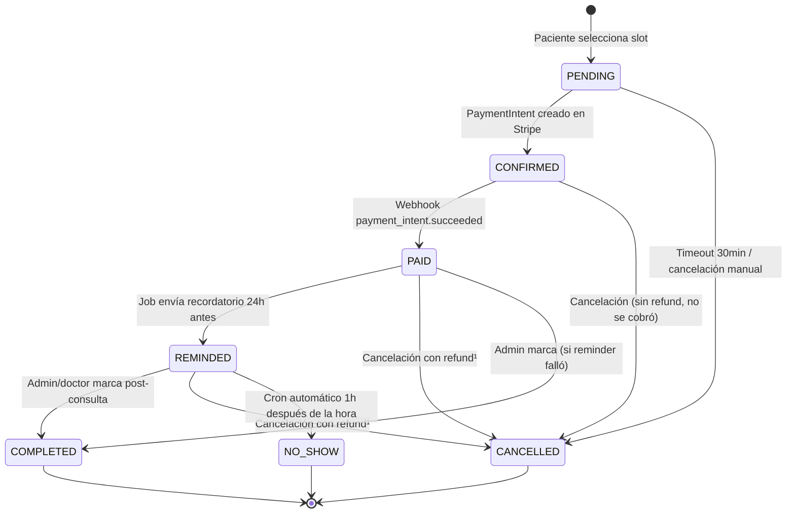
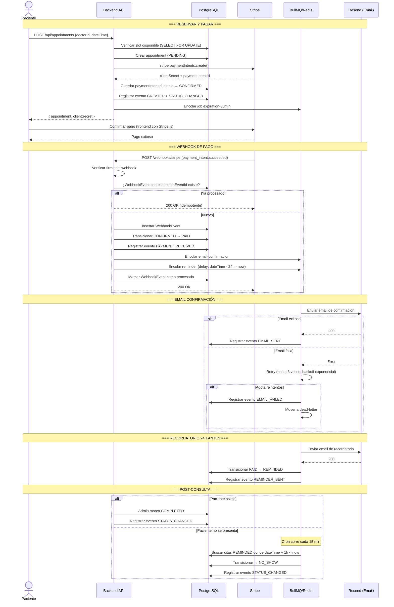
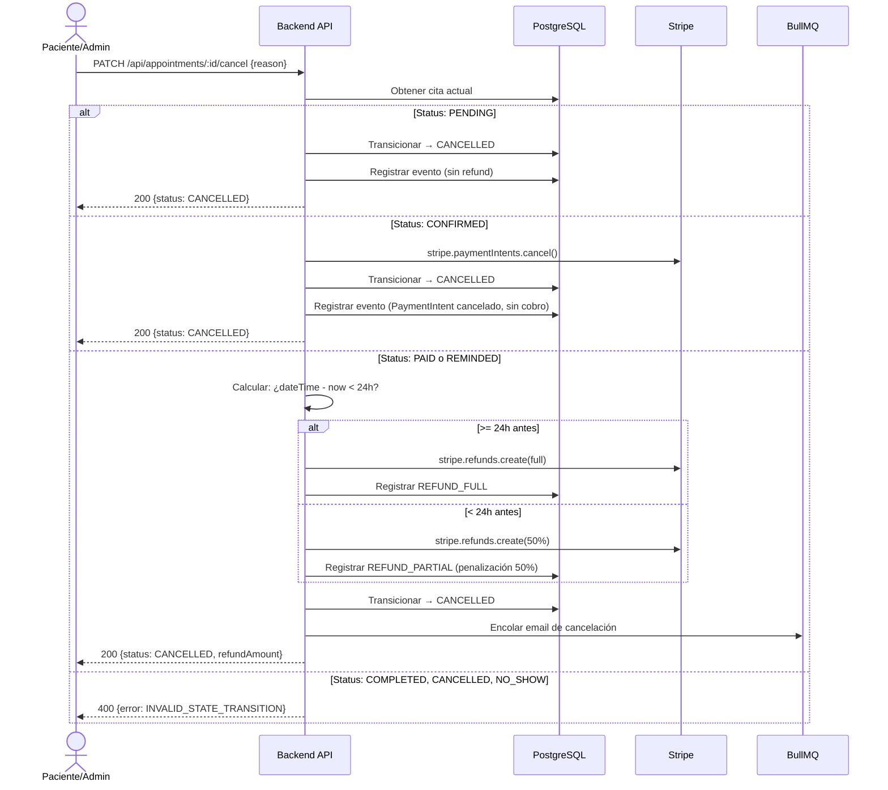

# SPEC.md — Clínica Scheduler

## Autor de diseño

Decisiones de estado, transiciones y manejo de errores definidas por el desarrollador.
Este documento refleja las decisiones de diseño tomadas antes de escribir código.

> **Nota de migración (Challenge 4):** las secciones 1 a 6 de este documento describen el
> **monolito del Challenge 3** y siguen vigentes — el flujo end-to-end que documentan debe seguir
> funcionando durante toda la migración (estrategia strangler fig, ver `PLAN.md`). Todo lo que
> describen está **en migración** hacia los servicios definidos en la sección 7
> ("Arquitectura de servicios"), no deprecado: la state machine, la matriz de errores y los
> endpoints siguen siendo la fuente de verdad del comportamiento, solo cambia *dónde* vive cada
> pieza. Ver changelog al final del documento.

---

## 1. Diagrama de Estados de la Cita

### Estados

| Estado | Descripción | ¿Final? |
|---|---|---|
| `PENDING` | Cita creada, slot reservado, esperando que el paciente inicie pago | No |
| `CONFIRMED` | PaymentIntent creado en Stripe, intención de cobro registrada | No |
| `PAID` | Webhook `payment_intent.succeeded` recibido, cobro exitoso | No |
| `REMINDED` | Recordatorio enviado al paciente 24h antes de la cita | No |
| `COMPLETED` | El doctor/admin marcó que la consulta se realizó | Sí |
| `CANCELLED` | Cita cancelada (por paciente, admin, o expiración) | Sí |
| `NO_SHOW` | Paciente no se presentó (marcado automáticamente 1h después) | Sí |

### Diagrama Mermaid

¹ Política de refund: si la cancelación es **≥24h antes** de la cita → refund completo.
Si es **<24h antes** → refund del 50% (penalización).

### Tabla de Transiciones

| Desde | Hacia | Trigger | Side Effects | Quién |
|---|---|---|---|---|
| `PENDING` | `CONFIRMED` | Se crea PaymentIntent en Stripe | Log evento `STATUS_CHANGED`, guardar `stripePaymentIntentId` | Sistema (al crear cita) |
| `PENDING` | `CANCELLED` | Timeout 30min sin pago | Job `appointment-expiration` cancela, log evento | Sistema (BullMQ) |
| `PENDING` | `CANCELLED` | Paciente cancela antes de pagar | Log evento con motivo | Paciente / Admin |
| `CONFIRMED` | `PAID` | Webhook `payment_intent.succeeded` | Email confirmación, encolar reminder delayed, log evento, guardar `paidAt` | Sistema (webhook) |
| `CONFIRMED` | `CANCELLED` | Paciente o admin cancela | No requiere refund (cargo no capturado), cancelar PaymentIntent en Stripe, log evento | Paciente / Admin |
| `PAID` | `REMINDED` | Job de recordatorio 24h antes | Email/notificación reminder, log evento, guardar `remindedAt` | Sistema (BullMQ) |
| `PAID` | `CANCELLED` | Paciente o admin cancela | Refund en Stripe (completo o 50%), email cancelación, log evento | Paciente / Admin |
| `PAID` | `COMPLETED` | Admin marca (caso edge: reminder falló) | Log evento, guardar `completedAt` | Admin |
| `REMINDED` | `COMPLETED` | Admin/doctor marca post-consulta | Log evento, guardar `completedAt` | Admin |
| `REMINDED` | `CANCELLED` | Paciente o admin cancela (último momento) | Refund 50% (penalización), email cancelación, log evento | Paciente / Admin |
| `REMINDED` | `NO_SHOW` | Cron: 1h después de `dateTime` sin `COMPLETED` | Log evento, guardar `noShowAt`; sin refund | Sistema (cron) |

### Transiciones Inválidas (ejemplos)

Cualquier transición no listada arriba es inválida y debe lanzar `AppError` con código `INVALID_STATE_TRANSITION`.

Ejemplos: `COMPLETED → PENDING`, `CANCELLED → PAID`, `NO_SHOW → REMINDED`, `PAID → PENDING`.

---

## 2. Matriz de Errores

### 2.1 Errores de Pago (Stripe)

| Escenario | Estado actual | Qué pasa | Mitigación | Resultado |
|---|---|---|---|---|
| Stripe API caído al crear PaymentIntent | `PENDING` | Falla la creación de la cita | Retornar 503 al paciente, cita NO se crea. Log + Sentry | Paciente reintenta |
| Tarjeta rechazada | `CONFIRMED` | Webhook `payment_intent.payment_failed` | Registrar evento `PAYMENT_FAILED`, notificar al paciente por email. Cita sigue `CONFIRMED`, puede reintentar | Cita expira si no paga en 30min |
| Webhook `payment_intent.succeeded` llega duplicado | `CONFIRMED` → `PAID` | Segunda ejecución intenta transicionar `PAID → PAID` | Tabla `WebhookEvent` con `stripeEventId` unique. Si ya procesado → retornar 200, no operar | Sin duplicación |
| Webhook nunca llega | `CONFIRMED` | Cita queda en `CONFIRMED` indefinidamente | Job de expiración: si `CONFIRMED` por >30min sin pasar a `PAID`, verificar PaymentIntent en Stripe API directamente. Si pagó → transicionar. Si no → cancelar | Reconciliación |
| Stripe caído al hacer refund | `PAID` o `REMINDED` | Refund falla | Reintentar 3 veces con backoff. Si falla → marcar cita como `CANCELLATION_PENDING`, alerta a admin para refund manual | Admin resuelve |
| Webhook con firma inválida | N/A | Posible ataque o misconfiguration | Retornar 401, log warning + Sentry, no procesar | Stripe reintenta con firma correcta |

### 2.2 Errores de Email (Resend)

| Escenario | Tipo de email | Qué pasa | Mitigación | Resultado |
|---|---|---|---|---|
| Resend API caído | Confirmación | Email no se envía | BullMQ reintenta 3 veces (backoff: 5s, 25s, 125s) | Se envía en retry |
| 3 reintentos agotados | Confirmación | Email definitivamente no enviado | Mover a dead-letter queue. Registrar `AppointmentEvent` tipo `EMAIL_FAILED`. La cita sigue su flujo normal | Admin ve en dead-letter |
| Email rebota (dirección inválida) | Cualquiera | Resend retorna error de bounce | Registrar como `EMAIL_FAILED`, no reintentar (no tiene sentido). Marcar email del paciente como problemático | Admin contacta al paciente |
| Reminder email falla | Recordatorio | Paciente no recibe reminder | Misma estrategia de retry. Si falla → cita pasa a `REMINDED` de todos modos (el estado refleja que se intentó). Evento `EMAIL_FAILED` | Admin puede contactar manualmente |

### 2.3 Errores de Infraestructura

| Escenario | Impacto | Mitigación | Resultado |
|---|---|---|---|
| Redis caído | BullMQ no puede encolar jobs | Health check endpoint falla. Jobs críticos (confirmación de pago) se procesan síncronamente como fallback. Log + Sentry + alerta | Degradación controlada |
| PostgreSQL caído | Nada funciona | Health check falla. API retorna 503. Stripe webhooks retornan 500 → Stripe reintenta automáticamente | Se recupera solo al volver DB |
| Servidor se reinicia mid-job | Job en progreso se pierde | BullMQ jobs son persistentes en Redis. Al reiniciar, worker retoma jobs pendientes. Jobs deben ser idempotentes | Sin pérdida de datos |
| Cron de NO_SHOW falla | Citas no se marcan como no-show | Cron corre cada 15 minutos. Si una ejecución falla, la siguiente lo recoge. Verificación idempotente (solo actúa sobre `REMINDED` con `dateTime + 1h < now`) | Delay máximo de 15min |
| Sentry caído | No se registran errores | Log local (Pino) sigue funcionando. Sentry es fire-and-forget, nunca bloquea la app | Sin impacto funcional |

### 2.4 Errores de Concurrencia

| Escenario | Qué pasa | Mitigación |
|---|---|---|
| Dos pacientes reservan el mismo slot simultáneamente | Race condition en la creación | Transacción en DB: `SELECT ... FOR UPDATE` sobre el slot antes de insertar. El segundo falla con conflicto → retornar 409 |
| Admin cancela mientras paciente paga | Webhook llega para cita ya cancelada | State machine rechaza `CANCELLED → PAID`. Webhook se procesa como no-op, log warning. Refund automático del pago |
| Doble click en botón de cancelar | Dos requests de cancelación simultáneos | Idempotencia: si ya está `CANCELLED`, retornar éxito sin hacer nada. Lock optimista con versión |

---

## 3. Diagrama de Secuencia — Flujo Completo

---

## 4. Flujo de Cancelación

---

## 5. Políticas del Sistema

### 5.1 Expiración de Citas

- Citas en `PENDING` expiran a los **30 minutos** si no se crea PaymentIntent.
- Citas en `CONFIRMED` expiran a los **30 minutos** si el pago no se completa.
- Implementado con job delayed de BullMQ.
- El job verifica el estado actual antes de cancelar (idempotente).

### 5.2 Refunds

| Momento de cancelación | Refund |
|---|---|
| Estado `PENDING` | Sin cobro, sin refund |
| Estado `CONFIRMED` | PaymentIntent cancelado, sin cobro |
| Estado `PAID`/`REMINDED`, ≥24h antes | Refund completo (100%) |
| Estado `PAID`/`REMINDED`, <24h antes | Refund parcial (50%), penalización |
| Estado `COMPLETED`/`NO_SHOW` | No cancelable |

### 5.3 No-Show

- Cron job corre cada **15 minutos**.
- Busca citas en estado `REMINDED` cuyo `dateTime + 1 hora < now`.
- Las transiciona a `NO_SHOW` automáticamente.
- No genera refund.
- Queda registrado para métricas (tasa de no-show por doctor).

### 5.4 Idempotencia

- Webhooks: deduplicados por `stripeEventId` en tabla `WebhookEvent`.
- Jobs: verifican estado actual antes de operar. Si el estado ya avanzó, no-op.
- Cancelaciones: si ya está `CANCELLED`, retornar éxito sin error.
- Registros de idempotencia se limpian con cron cada 24h.

---

## 6. Endpoints del Sistema

### Pacientes
| Método | Ruta | Descripción |
|---|---|---|
| `POST` | `/api/patients` | Crear paciente (+ Stripe Customer) |
| `GET` | `/api/patients/:id` | Detalle con citas |
| `PATCH` | `/api/patients/:id` | Actualizar datos |
| `GET` | `/api/patients` | Listar (paginación cursor) |

### Doctores
| Método | Ruta | Descripción |
|---|---|---|
| `POST` | `/api/doctors` | Crear doctor |
| `GET` | `/api/doctors/:id` | Detalle con disponibilidad |
| `GET` | `/api/doctors` | Listar todos |
| `POST` | `/api/doctors/:id/availability` | Definir disponibilidad |
| `GET` | `/api/doctors/:id/slots` | Slots libres para una fecha |

### Citas
| Método | Ruta | Descripción |
|---|---|---|
| `POST` | `/api/appointments` | Crear cita |
| `GET` | `/api/appointments/:id` | Detalle con eventos |
| `GET` | `/api/appointments` | Listar con filtros |
| `PATCH` | `/api/appointments/:id/cancel` | Cancelar |
| `PATCH` | `/api/appointments/:id/complete` | Marcar completada |
| `PATCH` | `/api/appointments/:id/no-show` | Marcar no-show manual |

### Webhooks
| Método | Ruta | Descripción |
|---|---|---|
| `POST` | `/api/webhooks/stripe` | Receptor de webhooks Stripe |

### Admin
| Método | Ruta | Descripción |
|---|---|---|
| `GET` | `/api/admin/appointments` | Listar con filtros |
| `GET` | `/api/admin/appointments/:id` | Detalle con audit log |
| `PATCH` | `/api/admin/appointments/:id/cancel` | Cancelar con motivo |
| `PATCH` | `/api/admin/appointments/:id/complete` | Marcar completada |
| `PATCH` | `/api/admin/appointments/:id/no-show` | Marcar no-show |
| `GET` | `/api/admin/dashboard` | Estadísticas |
| `GET` | `/api/admin/events` | Timeline global |
| `GET` | `/api/admin/dead-letter` | Jobs fallidos |

> Estos endpoints son los del **monolito (Challenge 3), en migración**. El mapeo a los nuevos
> servicios está en la sección 7.

---

## 7. Arquitectura de servicios (Challenge 4 — en progreso)

> Estado: **Fase 0 completada** (diseño). Fase 1+ (código de servicios) todavía no inicia —
> ver `PLAN.md`.

### 7.1 Bounded contexts

Decididos y aprobados en [`RFC-001-bounded-contexts.md`](./RFC-001-bounded-contexts.md). Resumen:

| Servicio | Responsabilidad | BD propia |
|---|---|---|
| **Auth** | Login y JWT de usuarios Admin/Staff únicamente. Los pacientes no tienen cuenta. | Sí |
| **Appointments** | State machine de citas (sección 1 de este documento) + Patients como sub-dominio (candidato a extracción futura, no decidido aún). Tabla Outbox. | Sí |
| **Doctors** | Perfil de doctor, disponibilidad, cálculo de slots. | Sí |
| **Payments** | Integración Stripe: PaymentIntents, refunds, webhook receiver. | Sí |
| **Notifications** | Envío de email (y luego SMS), consumer de eventos, read-model propio (`AppointmentSnapshot`, `PatientSnapshot`, `DoctorSnapshot`). | Sí |

Esto reemplaza la única BD Postgres compartida que describe la sección 6 — cero estado
compartido entre servicios (regla #3 de `PLAN.md`): ningún servicio hace `SELECT` contra la base
de otro.

### 7.2 Comunicación entre servicios

Criterio completo en [`ADR-001-sync-vs-async.md`](./ADR-001-sync-vs-async.md): **HTTP síncrono
para queries, eventos asíncronos (Redis Streams) para efectos secundarios**. La regla central:
Appointments **nunca** depende síncronamente de Notifications — la creación de cita se completa
y publica su evento aunque Notifications esté caído (degraded mode).

Consistencia entre servicios vía **patrón Outbox** (sin 2PC), detallado en
[`ADR-002-transacciones-distribuidas.md`](./ADR-002-transacciones-distribuidas.md).

Versionado de contratos (`/v1`, deprecación, enums abiertos) en
[`ADR-003-versionado-apis.md`](./ADR-003-versionado-apis.md).

### 7.3 Contratos

OpenAPI 3.1 por servicio en [`packages/contracts/`](./packages/contracts/), incluyendo los
esquemas de los eventos de dominio (`AppointmentCreated`, `AppointmentStatusChanged`,
`PaymentSucceeded`, `PaymentFailed`, `RefundIssued`, `PatientUpdated`, `DoctorCreated`,
`DoctorUpdated`, `UserCreated`, `UserDeactivated`).

### 7.4 Diagrama de contenedores (C4 nivel 2)

Ver [`docs/architecture/C4-nivel2-contenedores.md`](./docs/architecture/C4-nivel2-contenedores.md).

---

## Changelog (Challenge 4)

- **2026-06-20** — Se agrega la sección 7 "Arquitectura de servicios". Se documentan los 5
  bounded contexts (Auth, Appointments, Doctors, Payments, Notifications) decididos en
  `RFC-001-bounded-contexts.md`, los 3 ADRs de Fase 0, los 5 contratos OpenAPI en
  `packages/contracts/` y el diagrama C4 nivel 2. Las secciones 1-6 (monolito del Challenge 3) se
  marcan como **en migración**, no se modifican ni se eliminan — siguen siendo la fuente de
  verdad del comportamiento mientras dure la estrategia strangler fig.
- **2026-06-20** — Fase 1 (andamiaje): se agrega `ADR-004-postgres-por-servicio.md` (instancias
  separadas de Postgres por servicio, no una compartida con BDs separadas). Se crean los
  esqueletos de los 5 servicios (`services/{auth,appointments,doctors,payments,notifications}`,
  solo `/health` + `/metrics`, sin lógica de dominio) y el `gateway/` (reverse proxy con
  `@fastify/http-proxy` + verificación JWT stateless vía JWKS de Auth con `jose`, según RFC-001
  decisión 2). `docker-compose.yml` se extiende con el gateway, los 5 servicios y un Postgres por
  servicio, sin tocar los servicios del monolito (`postgres`, `redis`) que siguen sirviendo al
  Challenge 3. Se agregan workflows de GitHub Actions con `paths:` filters por servicio
  (`.github/workflows/{servicio}-ci.yml`) y se acota el `ci.yml` del monolito a sus propios paths,
  habilitando build/test independiente por servicio. Se cablean Prometheus (`infra/prometheus/`)
  y Grafana (`infra/grafana/`) en el compose, sin métricas RED reales todavía (eso es Fase 4).
- **2026-06-20** — Resuelto: Ricardo confirmó que el paciente **sí** puede cancelar su propia
  cita sin tener cuenta, identificado por posesión del UUID de la cita (capability token, no
  sesión) — igual que ya funciona en el monolito (`cancel` no está detrás de
  `requireAdminAuth`). Se actualiza `RFC-001-bounded-contexts.md` (aclaración a la decisión 1),
  `gateway/src/middleware/verify-jwt.ts` (rutas públicas: detalle y cancelación de cita por
  UUID) y `packages/contracts/appointments/openapi.yaml` (se quita `security: bearerAuth` de
  `getAppointment` y `cancelAppointment`; `listAppointments` sigue exclusivo de Admin/Staff).
- **2026-06-20** — Fase 2, paso 1 (Auth, primer servicio extraído de verdad — orden por
  acoplamiento creciente según `PLAN.md`): implementación real (no esqueleto) de
  `services/auth/`. Prisma propio (`User`, `RefreshToken`, `OutboxEvent` — outbox transaccional
  según ADR-002, el relay a Redis Streams queda para la Fase 3). JWT RS256 firmado con llave
  generada en memoria del proceso (limitación documentada en `src/lib/keys.ts`: un reinicio rota
  el `kid` e invalida tokens previos — aceptado para esta fase, pendiente de pasar a una llave
  persistida más adelante sin tocar contratos). `POST /v1/auth/login`, `POST /v1/auth/refresh`
  (con rotación de refresh token), `GET /v1/auth/.well-known/jwks.json`, `POST /v1/users`,
  `GET /v1/users`, `PATCH /v1/users/:id/deactivate`. 25 tests (unitarios con repos fake +
  integración contra Postgres real, incluyendo verificación JWKS end-to-end por HTTP).
  Verificado con `docker build` real (requirió agregar OpenSSL a la imagen Alpine y corregir
  `.dockerignore` faltante — sin él, `COPY . .` pisaba el `node_modules` del contenedor con el
  del host).
  **Bug de Fase 1 corregido de paso:** los `tsconfig.json` de los 6 paquetes nuevos extendían
  `tsconfig.base.json` fuera de su propio directorio — funcionaba en local pero rompía
  `docker build` (el contexto de build de cada servicio no incluye la raíz del repo). Se hizo
  cada `tsconfig.json` autocontenido y se separó un `tsconfig.eslint.json` (incluye tests) del
  `tsconfig.json` de build (solo `src/`, para que `dist/server.js` quede en la ruta esperada por
  el `CMD` del Dockerfile). También se acotó el `.eslintrc.cjs` del monolito para que su
  `npm run lint` no intente entrar a `services/`, `gateway/` ni `packages/` (cada uno lintea con
  su propio pipeline).
  **E2E del monolito verificado en verde tras todos estos cambios:** 130/130 tests, lint y
  typecheck del Challenge 3 sin errores (estrategia strangler fig respetada, regla #2 del plan).
- **2026-06-20** — Fase 2, paso 2 (Appointments, el core): implementación real de
  `services/appointments/`, incluyendo **Patients como sub-dominio** (RFC-001). Prisma propio
  (`Patient`, `Appointment`, `AppointmentEvent`, `OutboxEvent`). State machine portada del
  monolito 1:1, ahora escribiendo `AppointmentCreated` (en la misma transacción que la cita,
  exigido explícitamente por `PLAN.md` Fase 2 paso 2) y `AppointmentStatusChanged`/
  `PatientUpdated` en el Outbox en cada transición (ADR-002). Clientes HTTP inyectables
  `DoctorsClient` y `PaymentsClient` (`src/clients/`) reemplazan el `doctorRepository` y el
  `stripeClient` directos del monolito — Appointments ya no tiene su propia tabla `Doctor` ni
  llama a Stripe directamente (RFC-001 decisiones 3 y 5; ADR-001: son llamadas síncronas porque
  el paciente necesita el resultado en la misma respuesta HTTP).
  **Contrato ampliado:** se agregó `POST /v1/customers` a `packages/contracts/payments/openapi.yaml`
  — Patients necesitaba crear un Stripe Customer, y Payments es el único dueño de la integración
  Stripe (RFC-001 decisión 3); no estaba en el contrato original de la Fase 0.
  46 tests (unitarios + integración con Postgres real, Doctors/Payments mockeados, igual patrón
  que ya usa el monolito con `fakeStripeClient`). Build de Docker real verificado, incluyendo que
  el servicio responde con gracia (502 `PAYMENTS_UNAVAILABLE`, no un crash) cuando Payments no
  está disponible.
  **Scope diferido en esa entrega, resuelto en la siguiente (mismo día, a pedido explícito de
  Ricardo: "resolvamos todos los puntos uno por uno").** Los 4 puntos quedaron cerrados así:

  1. **`GET /patients/by-email`** — agregado al contrato de Appointments y a la implementación
     (`patients.service.getByEmail`), público en el gateway (igual que el monolito: sin auth,
     usado por el flujo de reserva para evitar pacientes duplicados).
  2. **Distinción `cancelledBy: ADMIN` vs `PATIENT`** — resuelto sin requerir una ruta admin
     separada: `verifyJwt` en el gateway ahora intenta parsear el JWT incluso en rutas públicas
     (best-effort, nunca bloquea si no hay token o es inválido) y, si hay uno válido, el proxy
     reenvía el rol en un header interno `x-internal-user-role` (`gateway/src/routes/proxy.ts`).
     Appointments lo lee en `lib/internal-role.ts` para decidir `cancelledBy`. Mismo límite de
     confianza de red interna que ya se documentó para `services/auth`.
  3. **Colas de BullMQ (expiración, recordatorio, no-show)** — portadas a
     `services/appointments/src/queues/`, con un cambio de fondo respecto al monolito: el worker
     de recordatorio **ya no envía el email** (esa responsabilidad es de Notifications); solo
     hace la transición `PAID → REMINDED` en el momento correcto y deja el aviso al futuro
     consumer de Notifications vía el evento `AppointmentStatusChanged`/`REMINDER_SENT` (se agregó
     `REMINDER_SENT` al enum `EventType`, con su propia migración).
  4. **`CONFIRMED → PAID` conectado a un consumer real** — esto requirió construir, antes de
     tiempo respecto al orden original del plan, una porción de la Fase 3:
     - **Payments real** (`services/payments/`): integración Stripe completa (customers,
       PaymentIntents, refunds), webhook receiver con verificación de firma e idempotencia
       (`WebhookEvent`, igual patrón que el monolito). Payments **nunca toca la BD de
       Appointments**: el `appointmentId` viaja en los metadata del PaymentIntent (seteado al
       crearlo), no se busca en ninguna tabla ajena.
     - **Relay del Outbox** (`src/lib/outbox-relay.ts`, idéntico en ambos servicios): poll cada
       2s de `OutboxEvent` con `publishedAt: null`, `XADD` a un stream Redis compartido
       (`domain-events`), marca `publishedAt`. Implementado en Payments y Appointments.
     - **Consumer de eventos** (`services/appointments/src/lib/event-consumer.ts`): consumer
       group de Redis Streams (`XREADGROUP`/`XACK`, at-least-once) que escucha
       `PaymentSucceeded`/`PaymentFailed` y llama a `confirmPayment`/`recordPaymentFailed`.
       Idempotente: si la cita ya no está en `CONFIRMED` (evento duplicado), trata
       `INVALID_STATE_TRANSITION` como éxito en vez de reintentar indefinidamente.
     - Verificado con Postgres y Redis reales (no solo mocks): test de integración que publica al
       stream real y confirma la transición de estado, además de build de Docker real para ambos
       servicios.

  **Nuevo gap encontrado y documentado (no resuelto, queda para Fase 4/5):** los entries del
  stream que fallan de forma permanente (ej. una cita borrada, un payload corrupto) nunca se
  acknowlegean y quedan en la Pending Entries List del consumer group para siempre — no hay
  todavía una cola de dead-letter para eventos de dominio (sí existe para jobs de BullMQ). Antes
  de ir a producción real, esto necesita un mecanismo de "N reintentos y a dead-letter", como ya
  tiene el monolito para sus colas.

  El monolito (Challenge 3) sigue siendo la única implementación que recibe tráfico real de
  punta a punta; los servicios nuevos corren en paralelo, verificados con tests e2e propios y
  build de Docker, pero todavía no están detrás del gateway en producción.

- **2026-06-20** — Fase 2, paso 3 (Notifications, último servicio de la Fase 2): implementación
  real de `services/notifications/`, dirigido enteramente por eventos (sin webhook ni endpoint de
  negocio propio, solo `GET /dead-letter` para auditoría). Read-model propio
  (`AppointmentSnapshot`, `PatientSnapshot`, `DoctorSnapshot` — RFC-001 decisión 4) reconstruido
  consumiendo `AppointmentCreated`, `AppointmentStatusChanged`, `PatientUpdated`,
  `DoctorCreated`/`DoctorUpdated` y `PaymentFailed` del mismo stream que consume Appointments,
  cada servicio con su propio consumer group (Redis Streams permite varios lectores
  independientes del mismo stream). **Abstracción de canal** (`NotificationChannel`) con
  `EmailChannel` (Resend) como única implementación hoy — agregar `SmsChannel` more adelante es
  solo otra clase con la misma interfaz, sin tocar `notification.service.ts` (el punto del plan:
  "esto hace trivial el PR cronometrado de SMS"). Templates HTML portados 1:1 del monolito.
  **Ajustes retroactivos a Appointments para que esto funcionara de verdad:**
  - `AppointmentStatusChanged` ahora incluye `eventPayload` completo (antes solo llevaba
    `{appointmentId, from, to, trigger}`) — sin esto, Notifications no tenía el
    `refundAmountCents` para el email de cancelación.
  - `Patient.create()` también publica `PatientUpdated` (antes solo `update()` lo hacía) — sin
    esto, el read-model de Notifications nunca se enteraba de pacientes nuevos.
  **Gap conocido, documentado, no resuelto en este paso:** `DoctorSnapshot` se actualiza pero
  nunca se lee — los templates de email no incluyen nombre de doctor (igual que el monolito, así
  que no es una regresión), y Doctors sigue siendo un esqueleto sin emitir eventos reales.
  8 tests (unitarios con fakes + integración real: publica al stream, el consumer reconstruye el
  read-model y dispara el email de confirmación). Build de Docker real verificado.

- **2026-06-20** — Resuelto el gap de dead-letter para eventos de dominio (documentado arriba,
  "Ricardo: continua con notifications y luego resolvemos"). El bug real no era solo "falta
  dead-letter": **el reintento mismo nunca funcionaba**. `XREADGROUP` con el ID `'>'` solo entrega
  mensajes que el grupo nunca vio — un mensaje que falló y quedó sin `XACK` no volvía a
  entregarse jamás, se quedaba en la Pending Entries List para siempre sin que nada lo reintentara
  (no era "reintenta indefinidamente", era "nunca reintenta"). Se corrigió en
  `lib/event-consumer.ts` (idéntico en Appointments y Notifications):
  - Cada pasada del consumer ahora primero reclama (`XAUTOCLAIM`) entries pendientes hace más de
    `minIdleMs` (5s por defecto) sin `ACK`, antes de leer entries nuevas.
  - El número de intentos se lee de Redis (`XPENDING`, delivery count) — no se lleva una cuenta
    propia en memoria, que se perdería en cada reinicio del proceso.
  - Al llegar a `maxAttempts` (5 por defecto), se llama a un callback `onDeadLetter` opcional (el
    caller decide qué hacer — típicamente persistir en su propia tabla) y se hace `XACK` para
    sacarlo de la Pending Entries List. Sin esto, un evento "venenoso" bloquearía esa entry para
    siempre.
  - Se agregó `DeadLetterEntry` a ambos servicios (Appointments ahora también la tiene, no solo
    Notifications) y se conectó `onDeadLetter` en ambos `server.ts`.
  - Test de integración real: handler que siempre falla, `maxAttempts` bajo, verifica que
    `onDeadLetter` se llama exactamente una vez con el número de intentos correcto y que la
    Pending Entries List queda vacía después (no con un conteo de "processed", que resultó
    sensible a timing al correr la suite completa en paralelo — se cambió a verificar
    `XPENDING` directamente).

- **2026-06-20** — Idempotencia de envío en Notifications (gap explícito de la Fase 3:
  "mismo evento dos veces ≠ dos correos"). `NotificationLogRepository.wasAlreadySent(appointmentId,
  type)` se consulta al inicio de `NotificationService.deliver()`, antes de llamar al canal — si ya
  existe un `NotificationLog` con `status: 'SENT'` para ese `(appointmentId, type)`, se ignora el
  evento duplicado y se loguea como no-op (mismo patrón que ya usan los workers de BullMQ del
  monolito: verificar estado antes de actuar, nunca asumir que un evento es la primera vez que se
  ve). Test de integración real: publica el mismo `AppointmentStatusChanged` dos veces al stream
  real, verifica que `channel.send` se llamó exactamente una vez y que solo existe un
  `NotificationLog`.

- **2026-06-20** — Doctors deja de ser un esqueleto y se construye completo (decisión del usuario:
  "Construir Doctors real ahora", en vez de simular el demo con datos seedeados directamente en la
  DB). Prisma propio (`Doctor`, `Availability`, `OutboxEvent`). `slots.ts` portado del monolito con
  una divergencia deliberada exigida por RFC-001 decisión 5: `generateSlotsForDate()` ya no recibe
  `busyIntervals` — Doctors no tiene ni debe tener acceso a las reservas de Appointments (cero
  estado compartido). Doctors responde únicamente "¿este horario cae dentro de mi disponibilidad
  configurada?"; la detección de choques de horario (double-booking) es responsabilidad exclusiva
  de la transacción `Serializable` de `Appointments.createPending()`. Esto es un cambio de
  comportamiento intencional respecto al monolito (que mezclaba ambos checks en un solo
  `getSlots()`), documentado aquí para que no se lea como una regresión.
  `POST /v1/doctors/:id/availability` recibe un solo bloque por llamada (semántica aditiva), no un
  arreglo que reemplaza todo — así lo define el contrato ya aprobado en
  `packages/contracts/doctors/openapi.yaml` desde la Fase 0.
  16 tests (unitarios de `slots.ts` + integración con Postgres real). Bug encontrado y corregido en
  el propio test de integración: la fecha "próximo lunes" se calculaba con
  `date.toISOString().slice(0,10)` (UTC) pero el día de la semana con `date.getDay()` (local) —
  desalineado en timezones lejos de UTC, producía 0 slots. Se corrigió con un helper local
  `toLocalDateString()` consistente en getters locales. Build de Docker real verificado.

- **2026-06-21** — Bug de integración descubierto al ensayar el demo end-to-end real a través del
  gateway (no en tests — los tests del gateway mockean upstreams, así que esto nunca se había
  ejercitado contra un microservicio real): `POST /v1/doctors` vía el gateway fallaba en el
  servicio upstream con `FST_ERR_CTP_INVALID_CONTENT_LENGTH`
  ("Request body size did not match Content-Length"). Causa: Fastify parsea el JSON del body por
  default antes de que `@fastify/http-proxy` lo reenvíe; el proxy tiene que volver a serializarlo
  para reenviarlo, y ese `JSON.stringify` casi nunca produce los mismos bytes que el body original
  (espacios, orden de claves) — pero el header `Content-Length` que se reenvía es el original, sin
  recalcular. El upstream rechaza el mismatch. Corregido en
  `gateway/src/middleware/raw-body.ts`: un `contentTypeParser('*', { parseAs: 'buffer' }, ...)`
  catch-all que hace que el gateway nunca parsee el body, reenviándolo como bytes crudos
  idénticos. Verificado con `docker build` + `POST /v1/doctors` real a través del gateway tras el
  fix.

- **2026-06-21** — Ensayo real de "degraded mode" (Appointments nunca depende síncronamente de
  Notifications — guardrail explícito de `PLAN.md`), ejecutado contra el stack completo en Docker
  vía el gateway, no simulado:
  1. Se detuvo el contenedor `notifications` (`docker compose stop notifications`).
  2. Se creó un paciente y una cita reales a través del gateway (`POST /v1/patients`,
     `POST /v1/appointments`) — **la reserva se completó con éxito** (`status: CONFIRMED`,
     `PaymentIntent` de Stripe creado) sin que Notifications estuviera disponible en ningún
     momento.
  3. Se inspeccionó el stream `domain-events` con `XINFO GROUPS`: el consumer group `notifications`
     mostró `lag: 9` (9 eventos acumulados, `last-delivered-id: 0-0` — el grupo no había leído
     nada porque no había ningún proceso consumiendo).
  4. Se reinició `notifications` (`docker compose start notifications`). Sin intervención manual,
     el consumer hizo catch-up del backlog completo: `XINFO GROUPS` pasó a `lag: 0`,
     `entries-read: 9`. Se verificó en la DB de Notifications que los 9 eventos se procesaron
     (`NotificationSnapshot`/`AppointmentSnapshot` actualizados, `NotificationLog` con los emails de
     confirmación correspondientes en `status: SENT`).
  Conclusión: el desacople síncrono entre Appointments y Notifications, y la recuperación
  automática del backlog vía Redis Streams + consumer groups (sin reproceso manual, sin pérdida de
  eventos), funcionan de punta a punta contra contenedores reales, no solo en los tests de
  integración. Con esto se da por **concluida la Fase 3**.

- **2026-06-21** — Se conecta el panel admin (`admin/`, Challenge 3) a la migración real: hasta
  ahora seguía hablando con el monolito (`localhost:3000`, header `x-admin-key`). Se reescribe el
  login (`AdminAuthContext`/`AdminKeyGate`) para hacer `POST /v1/auth/login` real contra el gateway
  (JWT RS256, no key estática) y se agrega un `ErrorBoundary` (su ausencia hacía que cualquier
  excepción de render dejara la pantalla en blanco sin pista alguna — exactamente lo que pasó al
  encontrar el primer bug real de esta tarea).
  **Bugs reales encontrados al probar contra el gateway real (ninguno lo agarraban los tests, que
  mockean upstreams):**
  - `isPublicRoute()` del gateway no le quitaba el query string a la URL antes de matchear sus
    regex — `GET /v1/doctors/:id/slots?date=...` (que siempre lleva query string) nunca matcheaba
    como pública y devolvía 401. Corregido en `verify-jwt.ts` + tests nuevos.
  - El gateway no tenía CORS — el browser bloqueaba toda llamada desde el panel (otro origen)
    aunque `curl` funcionara perfecto. Se agregó `@fastify/cors` (mismo plugin que ya usa el
    monolito).
  - `GET /v1/doctors` devuelve `{ data: [...] }`, no un array plano — rompía `.find()`/`.map()` en
    el cliente y causaba la pantalla en blanco al reservar.
  Se agregó `GET /v1/patients/:id` a rutas públicas del gateway (necesario para el flujo de
  reserva).
- **2026-06-21** — **RFC-002**: decisión sobre dónde vive el dashboard/lista de citas/dead-letter
  del panel, que en el monolito vivían bajo `/api/admin/*` sin equivalente en ningún
  microservicio (RFC-001 nunca contempló un agregador de stats/eventos/dead-letter). Se
  presentaron 3 opciones (Appointments expone su propia API admin / nuevo servicio Admin-BFF /
  el gateway agrega) — decisión: **Appointments expone su propia API admin**, Notifications su
  propio dead-letter por separado, sin agregador nuevo (mantiene "cada servicio dueño de sus
  datos", cero bounded context nuevo). Ver `RFC-002-dashboard-admin.md`.
  **Implementación:**
  - Appointments: `GET /v1/admin/dashboard` (counts, revenue, no-show rate por doctor — solo
    `doctorId`, sin nombre: Appointments no tiene datos de Doctors, RFC-001 decisión 5), `GET
    /v1/admin/events` (eventos recientes por ventana de horas), `GET/POST/DELETE
    /v1/admin/dead-letter` (list/retry/remove). "Retry" no reinyecta el mensaje viejo a Redis
    Streams (un ID ya entregado no se puede reescribir) — escribe un `OutboxEvent` nuevo con el
    mismo type/payload y borra la entrada, todo en una transacción.
  - `appointments.repository.list()` pasa a paginación real por cursor (antes devolvía hasta 200
    resultados sin paginar) e incluye `patient` (relación local, sin costo extra — Patients es
    sub-dominio de Appointments). Mismo cambio para `findById`.
  - Notifications: se agregó `POST /v1/dead-letter/:id/retry` y `DELETE /v1/dead-letter/:id` al
    `GET /v1/dead-letter` que ya existía. "Retry" acá es distinto: Notifications es *consumer* de
    estos eventos, no su dueño — no hay nada que reinyectar. Reintentar re-ejecuta el mismo
    handler (extraído a `lib/event-handlers.ts`, compartido entre el consumer real de
    `server.ts` y este endpoint) con el payload guardado; si vuelve a fallar, la entrada NO se
    borra y se responde 500 (se puede reintentar de nuevo más tarde).
  - Panel admin: tipos y `api.ts` adaptados a los shapes reales (`doctorId` sin nombre — se
    resuelve contra la lista de doctores ya cargada; detalle de cita hace una consulta extra a
    Doctors, una sola, justificada por ADR-001 a diferencia de la lista que sería N+1).
    Dead-letter no tiene agregador: el panel pega a Appointments y Notifications por separado y
    junta los resultados marcando el origen de cada entrada. Se agregaron botones de
    reintentar/eliminar a `DeadLetterPage` (no existían antes). `stripePayment` en el detalle de
    cita queda `null` — gap documentado: Payments todavía no expone una consulta de solo lectura
    de un PaymentIntent.
  - Tests de integración nuevos en ambos servicios (Postgres real): 7 en Appointments (dashboard,
    eventos, dead-letter list/retry/remove/404s), 6 en Notifications (HTTP de dead-letter,
    incluyendo que un retry fallido NO borra la entrada).
  **Bug de aislamiento de tests descubierto en el camino:** correr los tests de integración de
  Notifications con el contenedor real de `notifications` *también* corriendo causaba fallos
  intermitentes — ambos consumen el mismo stream `domain-events` y la misma `notifications_db`,
  así que el contenedor real le ganaba de mano al test escribiendo su propio `NotificationLog`
  antes de que el test pudiera verificarlo. No es un bug de código: hay que parar los contenedores
  reales antes de correr la suite local contra la misma infra compartida.

## Fase 4 — Observabilidad y contract tests

- **2026-06-21** — **Métricas RED reales** (PLAN.md Fase 4, punto 1). Hasta ahora `/metrics` solo
  exponía las métricas default de Node (memoria, CPU, GC) — `lib/metrics.ts` decía explícitamente
  "se agregan en Fase 4". Se agregó a los 6 servicios (Auth, Appointments, Doctors, Payments,
  Notifications, Gateway) un middleware compartido (`middleware/metrics.ts`, mismo archivo
  duplicado a propósito en cada uno, mismo criterio que `event-consumer.ts`) con 3 métricas
  `prom-client` por endpoint: `http_requests_total` (Counter), `http_request_duration_seconds`
  (Histogram) y `http_request_errors_total` (Counter, solo status ≥ 500). Se usa
  `request.routeOptions.url` (el patrón de ruta registrado, ej. `/v1/appointments/:id`) y no
  `request.url` — si no, Prometheus termina con una serie de tiempo distinta por cada UUID y
  satura cardinalidad. Verificado en vivo contra Prometheus real: targets `up`, queries
  `sum(rate(http_requests_total[...])) by (route)` devolviendo datos reales tras tráfico real.
  **Dashboard de Grafana** (`infra/grafana/provisioning/dashboards/json/red-metrics.json`,
  provisionado, no manual): 5 paneles (rate, errors, p50, p95, distribución de status codes) con
  variable `$service` poblada desde `label_values(http_requests_total, job)`. Se le agregó un
  `uid: prometheus` fijo al datasource para poder referenciarlo desde el JSON sin depender de un
  UID autogenerado. Verificado provisionando real contra Grafana real (`GET
  /api/dashboards/uid/clinica-red-metrics` devuelve los 5 paneles).
- **2026-06-21** — **Script de carga** (PLAN.md Fase 4, punto 2): `scripts/loadtest.mjs`
  (autocannon, no k6 — no requiere instalar un binario aparte, alcanza con lo que ya hay en el
  monorepo Node). Simula un flujo realista por conexión: salud pública → navegación de doctores
  (pública) → login real → dashboard de admin → lista de citas, reusando el JWT obtenido en el
  login para las rutas protegidas del resto del ciclo. Verificado en vivo: 490 requests reales
  contra el gateway en 8s generaron series de tiempo reales y diversas (200s, un 500 transitorio
  de Doctors recién levantado) visibles en Prometheus.
- **2026-06-21** — **Docs públicas** (PLAN.md Fase 4, punto 4): `GET /docs` en el gateway lista los
  5 servicios; `GET /docs/:service` renderiza Redoc (vía CDN, sin dependencia nueva en el gateway)
  apuntando a `GET /docs/:service/openapi.yaml`, que sirve el YAML real. Los specs viven
  duplicados en `gateway/openapi-specs/` (copiados de `packages/contracts/`) porque el build de
  Docker del gateway no tiene acceso a esa carpeta — está fuera de su contexto (`build: ./gateway`
  en `docker-compose.yml`). Mismo trade-off que `event-consumer.ts`: hay que re-copiar a mano si un
  contrato cambia. Todas las rutas son públicas (no matchean ningún patrón de `/v1/...` en
  `verify-jwt.ts`, caen en el fallback "rutas propias del gateway"). Verificado contra Docker real.
- **2026-06-21** — **Contract tests con Pact** (PLAN.md Fase 4, punto 3b — se saltó deliberadamente
  la capa 3a, validador OpenAPI runtime, por decisión explícita: "saltear el validador OpenAPI,
  hacer solo Pact"). Sin Pact Broker (no se justifica para 5 servicios): los `.json` generados por
  los consumer tests se commitean en `pacts/` (carpeta compartida en la raíz) y los provider tests
  del otro lado los leen de ahí y los corren contra la app real (no un mock) de cada servicio. 4
  contratos:
  - **Appointments (consumer) ↔ Doctors (provider)**: `GET /v1/doctors/:id` (200 y 404),
    `GET /v1/doctors/:id/slots`.
  - **Appointments (consumer) ↔ Payments (provider)**: los 4 endpoints de `PaymentsClient`
    (customers, payment-intents, cancel, refunds).
  - **Gateway (consumer) ↔ Auth (provider)**: el JWKS — la única relación gateway↔servicio que
    tiene sentido modelar como contrato, porque el gateway es un proxy ciego en todo lo demás (no
    parsea los cuerpos que reenvía) salvo en `verify-jwt.ts`, que sí consume y parsea esta
    respuesta. El consumer test firma un JWT real y lo verifica contra el JWKS del mock —
    verificación criptográfica de punta a punta, no solo de shape.
  - **Pact de mensajes, Appointments (provider/productor) → Notifications (consumer/consumidor)**:
    el esquema de `AppointmentCreated` y `AppointmentStatusChanged`. Notifications es el
    "consumer" en términos de Pact (recibe el mensaje) aunque Appointments inicia la
    comunicación — al revés de los contratos HTTP. La verificación del lado de Appointments
    ejecuta el código real que escribe a Outbox (la transacción de `createPending` y
    `state-machine.transition`) contra Postgres real y devuelve el payload tal cual quedó
    persistido.
  **Bug de compatibilidad ESM real encontrado e instalando la librería:**
  `@pact-foundation/pact@16.5.0` depende de `https-proxy-agent`, que en su versión más reciente
  (9.x) es ESM-only (`"type": "module"`) — pact lo `require()`a internamente, lo que rompe bajo
  Node con `"type": "module"` (`ERR_REQUIRE_ESM`). Se fijó `"overrides": { "https-proxy-agent":
  "7.0.6" }` (última versión CJS) en el `package.json` de cada servicio/gateway que usa Pact.
  **2 bugs reales de producción encontrados por los contract tests** (ninguno lo agarraban los
  tests existentes, que mockean todo):
  - El cliente HTTP de `PaymentsClient.cancelPaymentIntent()` hace `POST` sin `Content-Type` ni
    body — Payments respondía `415 Unsupported Media Type` porque Fastify exige un parser
    registrado para cualquier content-type entrante, incluido "ninguno". Corregido agregando un
    parser catch-all (`addContentTypeParser('*', ...)`) en `middleware/raw-body.ts` de Payments,
    igual que ya existía en el gateway para otro motivo.
  - El tipo real de `Verifier.stateHandlers` (a diferencia del de la Proxy API que usan los
    `onDeadLetter`/handlers de eventos) exige una función simple `(state, params) =>
    Promise<unknown>`, no el `{setup, teardown}` que parecía más natural — se manifestaba como un
    error de TypeScript, no en runtime, así que solo se vio al corren `tsc --noEmit` después de
    que los tests ya pasaban.
  **Wireado como gate de CI**: los contract tests corren dentro del `npm run test` normal de cada
  servicio (ya era el gate existente, `vitest run` no tiene un include que los excluya). Se
  agregó el `.json` de cada pact a los `paths:` del workflow del lado **provider** correspondiente
  (`doctors-ci.yml`, `payments-ci.yml`, `auth-ci.yml`, `appointments-ci.yml` para el pact de
  mensajes) — sin eso, si un consumer cambia su contrato y lo commitea, el CI del provider
  correspondiente no se entera hasta que alguien toque su propio código.
  **Limitación aceptada y documentada**: sin Pact Broker, el flujo depende de que el desarrollador
  commitee el `.json` regenerado cuando cambia el código del consumer — no hay nada que fuerce
  ese commit automáticamente. Para 5 servicios esto es un trade-off razonable; si el sistema
  crece, esto es exactamente lo que un Pact Broker resolvería (registro central + "can-i-deploy").
