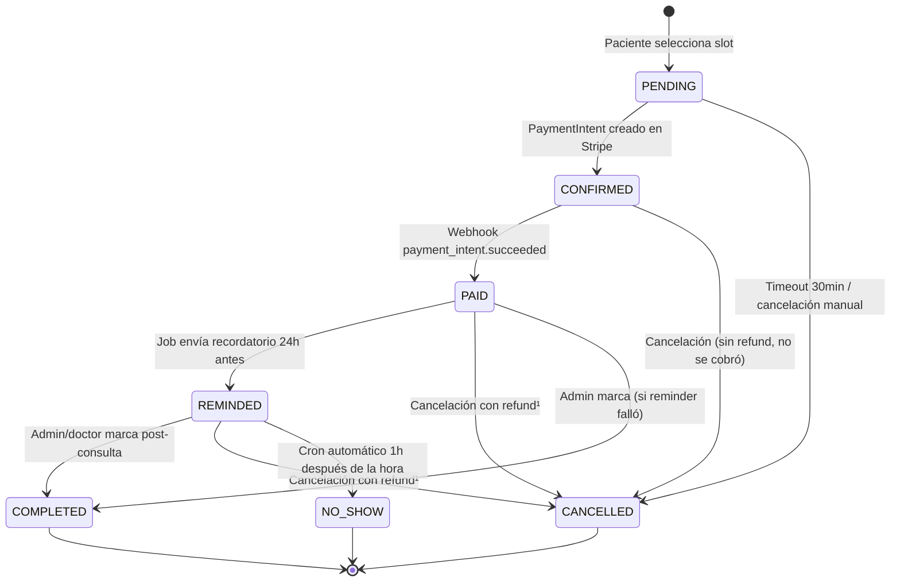
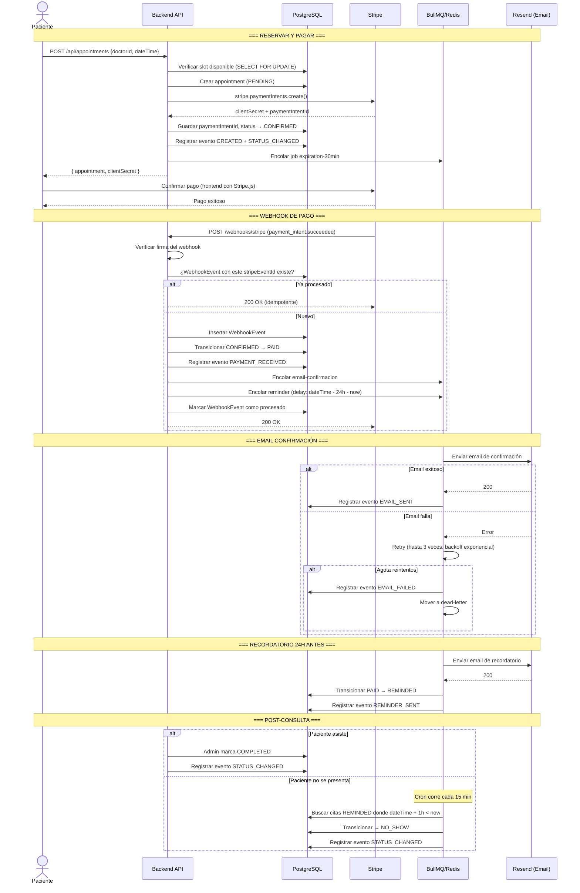
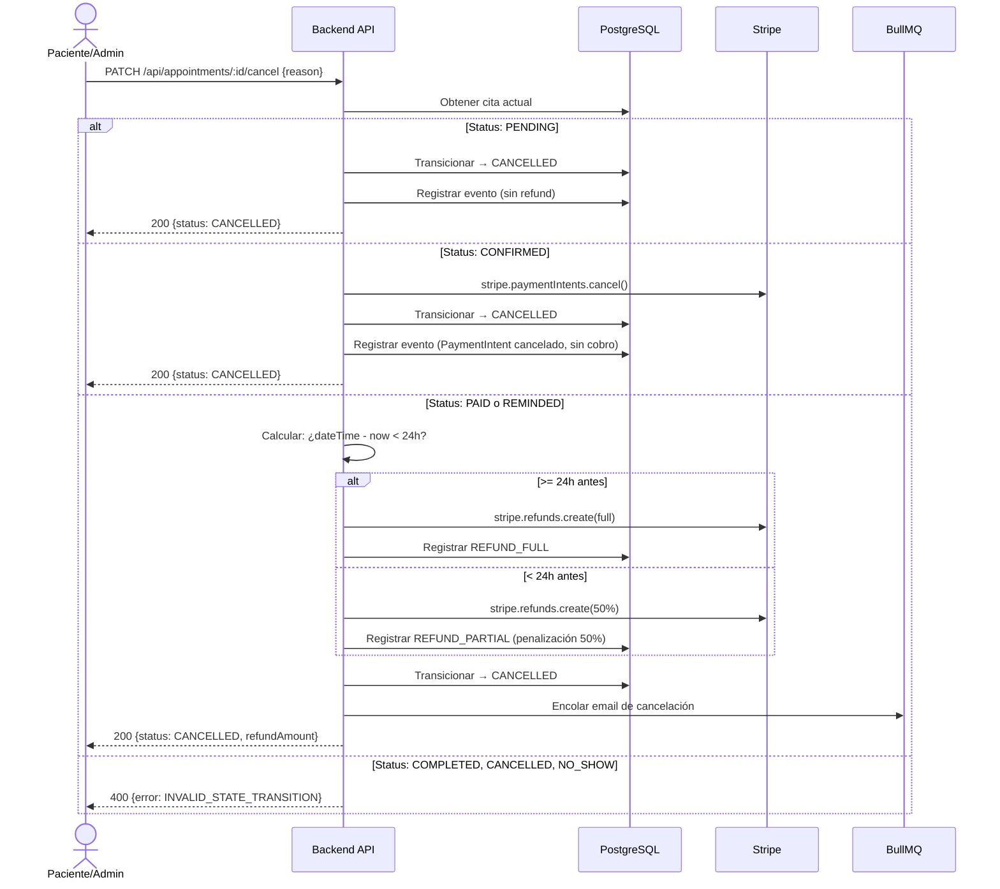

# SPEC.md — Clínica Scheduler

## Autor de diseño

Decisiones de estado, transiciones y manejo de errores definidas por el desarrollador.
Este documento refleja las decisiones de diseño tomadas antes de escribir código.

---

## 1. Diagrama de Estados de la Cita

### Estados

| Estado | Descripción | ¿Final? |
|---|---|---|
| `PENDING` | Cita creada, slot reservado, esperando que el paciente inicie pago | No |
| `CONFIRMED` | PaymentIntent creado en Stripe, intención de cobro registrada | No |
| `PAID` | Webhook `payment_intent.succeeded` recibido, cobro exitoso | No |
| `REMINDED` | Recordatorio enviado al paciente 24h antes de la cita | No |
| `COMPLETED` | El doctor/admin marcó que la consulta se realizó | Sí |
| `CANCELLED` | Cita cancelada (por paciente, admin, o expiración) | Sí |
| `NO_SHOW` | Paciente no se presentó (marcado automáticamente 1h después) | Sí |

### Diagrama Mermaid

¹ Política de refund: si la cancelación es **≥24h antes** de la cita → refund completo.
Si es **<24h antes** → refund del 50% (penalización).

### Tabla de Transiciones

| Desde | Hacia | Trigger | Side Effects | Quién |
|---|---|---|---|---|
| `PENDING` | `CONFIRMED` | Se crea PaymentIntent en Stripe | Log evento `STATUS_CHANGED`, guardar `stripePaymentIntentId` | Sistema (al crear cita) |
| `PENDING` | `CANCELLED` | Timeout 30min sin pago | Job `appointment-expiration` cancela, log evento | Sistema (BullMQ) |
| `PENDING` | `CANCELLED` | Paciente cancela antes de pagar | Log evento con motivo | Paciente / Admin |
| `CONFIRMED` | `PAID` | Webhook `payment_intent.succeeded` | Email confirmación, encolar reminder delayed, log evento, guardar `paidAt` | Sistema (webhook) |
| `CONFIRMED` | `CANCELLED` | Paciente o admin cancela | No requiere refund (cargo no capturado), cancelar PaymentIntent en Stripe, log evento | Paciente / Admin |
| `PAID` | `REMINDED` | Job de recordatorio 24h antes | Email/notificación reminder, log evento, guardar `remindedAt` | Sistema (BullMQ) |
| `PAID` | `CANCELLED` | Paciente o admin cancela | Refund en Stripe (completo o 50%), email cancelación, log evento | Paciente / Admin |
| `PAID` | `COMPLETED` | Admin marca (caso edge: reminder falló) | Log evento, guardar `completedAt` | Admin |
| `REMINDED` | `COMPLETED` | Admin/doctor marca post-consulta | Log evento, guardar `completedAt` | Admin |
| `REMINDED` | `CANCELLED` | Paciente o admin cancela (último momento) | Refund 50% (penalización), email cancelación, log evento | Paciente / Admin |
| `REMINDED` | `NO_SHOW` | Cron: 1h después de `dateTime` sin `COMPLETED` | Log evento, guardar `noShowAt`; sin refund | Sistema (cron) |

### Transiciones Inválidas (ejemplos)

Cualquier transición no listada arriba es inválida y debe lanzar `AppError` con código `INVALID_STATE_TRANSITION`.

Ejemplos: `COMPLETED → PENDING`, `CANCELLED → PAID`, `NO_SHOW → REMINDED`, `PAID → PENDING`.

---

## 2. Matriz de Errores

### 2.1 Errores de Pago (Stripe)

| Escenario | Estado actual | Qué pasa | Mitigación | Resultado |
|---|---|---|---|---|
| Stripe API caído al crear PaymentIntent | `PENDING` | Falla la creación de la cita | Retornar 503 al paciente, cita NO se crea. Log + Sentry | Paciente reintenta |
| Tarjeta rechazada | `CONFIRMED` | Webhook `payment_intent.payment_failed` | Registrar evento `PAYMENT_FAILED`, notificar al paciente por email. Cita sigue `CONFIRMED`, puede reintentar | Cita expira si no paga en 30min |
| Webhook `payment_intent.succeeded` llega duplicado | `CONFIRMED` → `PAID` | Segunda ejecución intenta transicionar `PAID → PAID` | Tabla `WebhookEvent` con `stripeEventId` unique. Si ya procesado → retornar 200, no operar | Sin duplicación |
| Webhook nunca llega | `CONFIRMED` | Cita queda en `CONFIRMED` indefinidamente | Job de expiración: si `CONFIRMED` por >30min sin pasar a `PAID`, verificar PaymentIntent en Stripe API directamente. Si pagó → transicionar. Si no → cancelar | Reconciliación |
| Stripe caído al hacer refund | `PAID` o `REMINDED` | Refund falla | Reintentar 3 veces con backoff. Si falla → marcar cita como `CANCELLATION_PENDING`, alerta a admin para refund manual | Admin resuelve |
| Webhook con firma inválida | N/A | Posible ataque o misconfiguration | Retornar 401, log warning + Sentry, no procesar | Stripe reintenta con firma correcta |

### 2.2 Errores de Email (Resend)

| Escenario | Tipo de email | Qué pasa | Mitigación | Resultado |
|---|---|---|---|---|
| Resend API caído | Confirmación | Email no se envía | BullMQ reintenta 3 veces (backoff: 5s, 25s, 125s) | Se envía en retry |
| 3 reintentos agotados | Confirmación | Email definitivamente no enviado | Mover a dead-letter queue. Registrar `AppointmentEvent` tipo `EMAIL_FAILED`. La cita sigue su flujo normal | Admin ve en dead-letter |
| Email rebota (dirección inválida) | Cualquiera | Resend retorna error de bounce | Registrar como `EMAIL_FAILED`, no reintentar (no tiene sentido). Marcar email del paciente como problemático | Admin contacta al paciente |
| Reminder email falla | Recordatorio | Paciente no recibe reminder | Misma estrategia de retry. Si falla → cita pasa a `REMINDED` de todos modos (el estado refleja que se intentó). Evento `EMAIL_FAILED` | Admin puede contactar manualmente |

### 2.3 Errores de Infraestructura

| Escenario | Impacto | Mitigación | Resultado |
|---|---|---|---|
| Redis caído | BullMQ no puede encolar jobs | Health check endpoint falla. Jobs críticos (confirmación de pago) se procesan síncronamente como fallback. Log + Sentry + alerta | Degradación controlada |
| PostgreSQL caído | Nada funciona | Health check falla. API retorna 503. Stripe webhooks retornan 500 → Stripe reintenta automáticamente | Se recupera solo al volver DB |
| Servidor se reinicia mid-job | Job en progreso se pierde | BullMQ jobs son persistentes en Redis. Al reiniciar, worker retoma jobs pendientes. Jobs deben ser idempotentes | Sin pérdida de datos |
| Cron de NO_SHOW falla | Citas no se marcan como no-show | Cron corre cada 15 minutos. Si una ejecución falla, la siguiente lo recoge. Verificación idempotente (solo actúa sobre `REMINDED` con `dateTime + 1h < now`) | Delay máximo de 15min |
| Sentry caído | No se registran errores | Log local (Pino) sigue funcionando. Sentry es fire-and-forget, nunca bloquea la app | Sin impacto funcional |

### 2.4 Errores de Concurrencia

| Escenario | Qué pasa | Mitigación |
|---|---|---|
| Dos pacientes reservan el mismo slot simultáneamente | Race condition en la creación | Transacción en DB: `SELECT ... FOR UPDATE` sobre el slot antes de insertar. El segundo falla con conflicto → retornar 409 |
| Admin cancela mientras paciente paga | Webhook llega para cita ya cancelada | State machine rechaza `CANCELLED → PAID`. Webhook se procesa como no-op, log warning. Refund automático del pago |
| Doble click en botón de cancelar | Dos requests de cancelación simultáneos | Idempotencia: si ya está `CANCELLED`, retornar éxito sin hacer nada. Lock optimista con versión |

---

## 3. Diagrama de Secuencia — Flujo Completo

---

## 4. Flujo de Cancelación

---

## 5. Políticas del Sistema

### 5.1 Expiración de Citas

- Citas en `PENDING` expiran a los **30 minutos** si no se crea PaymentIntent.
- Citas en `CONFIRMED` expiran a los **30 minutos** si el pago no se completa.
- Implementado con job delayed de BullMQ.
- El job verifica el estado actual antes de cancelar (idempotente).

### 5.2 Refunds

| Momento de cancelación | Refund |
|---|---|
| Estado `PENDING` | Sin cobro, sin refund |
| Estado `CONFIRMED` | PaymentIntent cancelado, sin cobro |
| Estado `PAID`/`REMINDED`, ≥24h antes | Refund completo (100%) |
| Estado `PAID`/`REMINDED`, <24h antes | Refund parcial (50%), penalización |
| Estado `COMPLETED`/`NO_SHOW` | No cancelable |

### 5.3 No-Show

- Cron job corre cada **15 minutos**.
- Busca citas en estado `REMINDED` cuyo `dateTime + 1 hora < now`.
- Las transiciona a `NO_SHOW` automáticamente.
- No genera refund.
- Queda registrado para métricas (tasa de no-show por doctor).

### 5.4 Idempotencia

- Webhooks: deduplicados por `stripeEventId` en tabla `WebhookEvent`.
- Jobs: verifican estado actual antes de operar. Si el estado ya avanzó, no-op.
- Cancelaciones: si ya está `CANCELLED`, retornar éxito sin error.
- Registros de idempotencia se limpian con cron cada 24h.

---

## 6. Endpoints del Sistema

### Pacientes
| Método | Ruta | Descripción |
|---|---|---|
| `POST` | `/api/patients` | Crear paciente (+ Stripe Customer) |
| `GET` | `/api/patients/:id` | Detalle con citas |
| `PATCH` | `/api/patients/:id` | Actualizar datos |
| `GET` | `/api/patients` | Listar (paginación cursor) |

### Doctores
| Método | Ruta | Descripción |
|---|---|---|
| `POST` | `/api/doctors` | Crear doctor |
| `GET` | `/api/doctors/:id` | Detalle con disponibilidad |
| `GET` | `/api/doctors` | Listar todos |
| `POST` | `/api/doctors/:id/availability` | Definir disponibilidad |
| `GET` | `/api/doctors/:id/slots` | Slots libres para una fecha |

### Citas
| Método | Ruta | Descripción |
|---|---|---|
| `POST` | `/api/appointments` | Crear cita |
| `GET` | `/api/appointments/:id` | Detalle con eventos |
| `GET` | `/api/appointments` | Listar con filtros |
| `PATCH` | `/api/appointments/:id/cancel` | Cancelar |
| `PATCH` | `/api/appointments/:id/complete` | Marcar completada |
| `PATCH` | `/api/appointments/:id/no-show` | Marcar no-show manual |

### Webhooks
| Método | Ruta | Descripción |
|---|---|---|
| `POST` | `/api/webhooks/stripe` | Receptor de webhooks Stripe |

### Admin
| Método | Ruta | Descripción |
|---|---|---|
| `GET` | `/api/admin/appointments` | Listar con filtros |
| `GET` | `/api/admin/appointments/:id` | Detalle con audit log |
| `PATCH` | `/api/admin/appointments/:id/cancel` | Cancelar con motivo |
| `PATCH` | `/api/admin/appointments/:id/complete` | Marcar completada |
| `PATCH` | `/api/admin/appointments/:id/no-show` | Marcar no-show |
| `GET` | `/api/admin/dashboard` | Estadísticas |
| `GET` | `/api/admin/events` | Timeline global |
| `GET` | `/api/admin/dead-letter` | Jobs fallidos |
