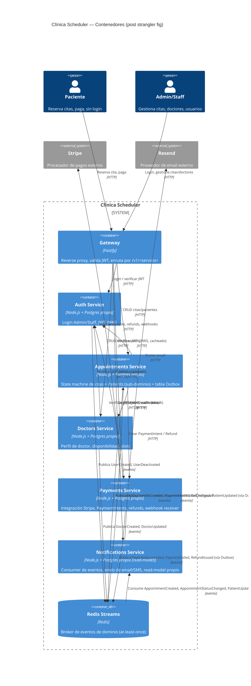

# C4 Nivel 2 — Diagrama de Contenedores

Referencia: [RFC-001-bounded-contexts.md](../../RFC-001-bounded-contexts.md),
[ADR-001-sync-vs-async.md](../../ADR-001-sync-vs-async.md),
[ADR-002-transacciones-distribuidas.md](../../ADR-002-transacciones-distribuidas.md).

Cada flecha está etiquetada explícitamente como **HTTP** (síncrono) o **evento** (asíncrono, vía
Redis Streams). Esta etiqueta no es decorativa: es la regla de ADR-001 aplicada visualmente.

## Lectura del diagrama

- **Toda flecha HTTP es una dependencia dura**: si ese contenedor cae, la operación falla. Esto es
  aceptado para Doctors y Payments en el flujo de creación de cita (ver ADR-001) — no para
  Notifications.
- **Ninguna flecha HTTP llega a Notifications desde Appointments.** Esa es la verificación visual
  de la regla #4 del plan: la reserva de citas no depende síncronamente de Notifications. Solo
  hay flechas de evento hacia Notifications.
- **Auth nunca es consultado por BD** por otro servicio — solo expone JWKS vía HTTP, que los demás
  cachean localmente (ver RFC-001 decisión 2). Ningún servicio hace `SELECT` contra la base de
  Auth.
- **Redis Streams es el único canal de eventos**; no hay colas punto a punto entre servicios.
