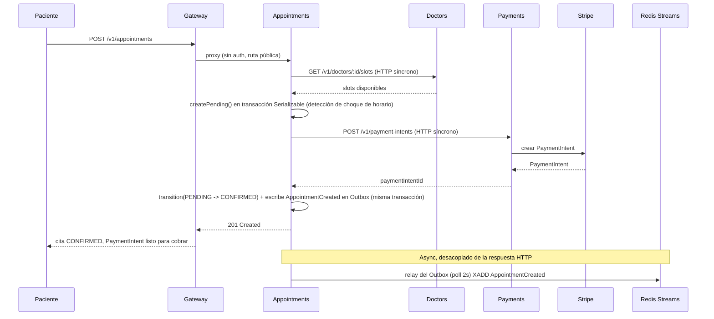
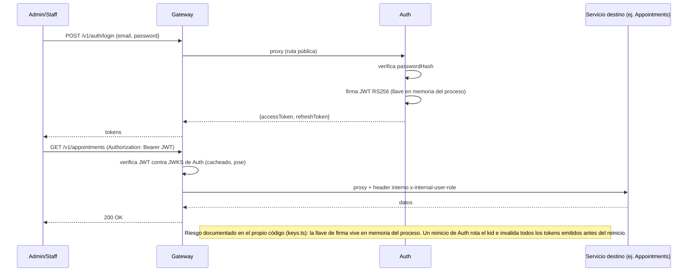

# Baseline post-Challenge 4 — Inventario de línea base

**Fase:** 0 del `claude/PLAN-challenge-5-plataforma-para-todos.md`
**Objetivo:** documentar exactamente qué se hereda del Challenge 4 antes de decidir sobre tenancy, compliance y costos en la Fase 1.
**Alcance:** solo diagnóstico. Este documento no propone soluciones ni decide arquitectura.

**Contexto de entorno confirmado con Ricardo:** no existe producción real todavía. Todo lo aquí
documentado corre en Docker Compose local, con tráfico simulado (no hay clínicas reales usando el
sistema hoy). El monolito del Challenge 3 (`src/` en la raíz) no recibe tráfico real tampoco, pero
se trata como sistema vivo para efectos de este inventario porque el challenge pide simular que sí
lo recibe.

---

## 1. Servicios

| Servicio | Responsabilidad | Puerto | Dependencias externas | Tablas propias | Jobs/workers | Endpoints HTTP expuestos |
|---|---|---|---|---|---|---|
| **monolito** (`src/`, Challenge 3, legado/simulado) | Sistema original de una sola clínica: pacientes, doctores, citas (state machine), pagos Stripe, notificaciones email, panel admin. Se mantiene intacto por la estrategia strangler fig. | 3000 | Stripe, Resend, Sentry | Ver sección 2 (`Patient`, `Doctor`, `Availability`, `Appointment`, `AppointmentEvent`, `IdempotencyRecord`, `WebhookEvent`) | BullMQ: `appointment-expiration`, `appointment-reminders` (envía email), `appointment-noshow`, `email-notifications` | `/api/patients/*`, `/api/doctors/*`, `/api/appointments/*`, `/api/webhooks/stripe`, `/api/admin/*`, `/health` |
| **gateway** | Reverse proxy + verificación JWT (JWKS de Auth, cacheado con `jose`) + enrutamiento `/v1/<servicio>` + docs públicas (Redoc) | 4000 | Auth (JWKS) | Ninguna (stateless) | Ninguno | `/v1/*` (proxy a los 5 servicios), `/docs`, `/docs/:service`, `/docs/:service/openapi.yaml`, `/health`, `/metrics` |
| **auth** | Login/registro de Admin/Staff, emisión y verificación de JWT RS256, JWKS | 4001 | Ninguna | `User`, `RefreshToken`, `OutboxEvent` | Ninguno | `POST /v1/auth/login`, `POST /v1/auth/refresh`, `GET /v1/auth/.well-known/jwks.json`, `POST /v1/users`, `GET /v1/users`, `PATCH /v1/users/:id/deactivate` |
| **appointments** | State machine de citas + Patients (sub-dominio) + API admin (dashboard, eventos, dead-letter) | 4002 | Doctors (HTTP síncrono), Payments (HTTP síncrono), Auth (JWKS) | `Patient`, `Appointment`, `AppointmentEvent`, `OutboxEvent`, `DeadLetterEntry` | BullMQ: `appointment-expiration`, `appointment-reminders` (solo transición de estado, ya no envía email), `appointment-noshow`. Consumer de Redis Streams: `PaymentSucceeded`/`PaymentFailed` | `POST /v1/appointments`, `GET /v1/appointments/:id`, `PATCH /v1/appointments/:id/cancel`, `GET /v1/appointments`, `PATCH /v1/appointments/:id/complete`, `PATCH /v1/appointments/:id/no-show`, `POST /v1/patients`, `GET /v1/patients/by-email`, `GET /v1/patients/:id`, `PATCH /v1/patients/:id`, `GET /v1/patients`, `GET /v1/admin/dashboard`, `GET /v1/admin/events`, `GET/POST/DELETE /v1/admin/dead-letter*` |
| **doctors** | Perfil de doctor, disponibilidad configurada, generación de slots libres | 4003 | Ninguna | `Doctor`, `Availability`, `OutboxEvent` | Ninguno | `POST /v1/doctors`, `GET /v1/doctors`, `GET /v1/doctors/:id`, `POST /v1/doctors/:id/availability`, `GET /v1/doctors/:id/slots` |
| **payments** | Integración Stripe (customers, PaymentIntents, refunds), webhook receiver con idempotencia | 4004 | Stripe | `WebhookEvent`, `OutboxEvent` | Ninguno | `POST /v1/customers`, `POST /v1/payment-intents`, `POST /v1/payment-intents/:id/cancel`, `POST /v1/refunds`, `POST /v1/webhooks/stripe` |
| **notifications** | Consumer de eventos de dominio, envío de email (Resend), read-model propio, dead-letter | 4005 | Resend | `AppointmentSnapshot`, `PatientSnapshot`, `DoctorSnapshot`, `NotificationLog`, `DeadLetterEntry` | Ninguno (BullMQ). Consumer de Redis Streams: `AppointmentCreated`, `AppointmentStatusChanged`, `PatientUpdated`, `DoctorCreated`, `DoctorUpdated`, `PaymentFailed` | `GET /v1/dead-letter`, `POST /v1/dead-letter/:id/retry`, `DELETE /v1/dead-letter/:id` |

**Nota sobre dueño de datos:** ninguna tabla es escrita por dos servicios. Appointments y Doctors mantienen esquemas `Doctor`/`Availability` estructuralmente idénticos por separado — no es una violación (Appointments ya no tiene esa tabla en su schema real, ver sección 2), es una confusión posible por nombres iguales entre el monolito y Doctors; se deja anotado como posible fuente de error de lectura en revisiones futuras.

---

## 2. Modelo de datos

Convención: **PII** = dato personal identificable. **Salud** = dato personal sensible de salud bajo LFPDPPP (incluye inferencia por combinación, ej. especialidad médica + cita). **Tenant** = ninguna tabla tiene columna de tenant/clínica hoy (ver Supuesto S5 más abajo, confirmado falso).

### 2.1 Monolito (`src/prisma/schema.prisma`)

| Tabla | Columna | Tipo | ¿PII? | ¿Salud? | Servicio dueño | ¿Col. tenant/clinic? |
|---|---|---|---|---|---|---|
| Patient | id | UUID | No | No | monolito | No |
| Patient | email | String | **Sí** | No | monolito | No |
| Patient | name | String | **Sí** | No | monolito | No |
| Patient | phone | String | **Sí** | No | monolito | No |
| Patient | stripeCustomerId | String? | **Sí** (identificador financiero) | No | monolito | No |
| Patient | createdAt/updatedAt | DateTime | No | No | monolito | No |
| Doctor | id | UUID | No | No | monolito | No |
| Doctor | name | String | **Sí** (dato de personal, menor sensibilidad) | No | monolito | No |
| Doctor | email | String | **Sí** | No | monolito | No |
| Doctor | specialty | String | No directo | **Sí, por combinación** (ver nota) | monolito | No |
| Doctor | consultationPriceCents | Int | No | No | monolito | No |
| Availability | dayOfWeek/startTime/endTime | Int/String | No | No | monolito | No |
| Appointment | id | UUID | No | No | monolito | No |
| Appointment | patientId | UUID (FK) | **Sí** (enlaza a PII) | No | monolito | No |
| Appointment | doctorId | UUID (FK) | No directo | **Sí, por combinación** con `Doctor.specialty` | monolito | No |
| Appointment | dateTime | DateTime | No directo | **Sí, por combinación** (revela que el paciente buscó atención médica en fecha/hora específica) | monolito | No |
| Appointment | amountCents | Int | No | No | monolito | No |
| Appointment | status | Enum | No | No | monolito | No |
| Appointment | cancellationReason | String? | REVISAR (texto libre, puede contener info de salud si el paciente/staff lo escribe) | REVISAR | monolito | No |
| Appointment | stripePaymentIntentId | String? | **Sí** (identificador financiero) | No | monolito | No |
| Appointment | confirmedAt/paidAt/remindedAt/completedAt/cancelledAt/noShowAt | DateTime? | No | No | monolito | No |
| AppointmentEvent | payload | Json | REVISAR (snapshot de cambios, puede incluir cualquier campo de arriba) | REVISAR | monolito | No |
| IdempotencyRecord | response | Json | REVISAR (respuesta cacheada completa, puede incluir PII) | REVISAR | monolito | No |
| WebhookEvent | payload | Json | **Sí** (payload crudo de Stripe: incluye datos de cliente y pago) | No | monolito | No |

### 2.2 Auth (`services/auth/prisma/schema.prisma`)

| Tabla | Columna | Tipo | ¿PII? | ¿Salud? | Servicio dueño | ¿Col. tenant/clinic? |
|---|---|---|---|---|---|---|
| User | id | UUID | No | No | auth | No |
| User | email | String | **Sí** | No | auth | No |
| User | name | String | **Sí** | No | auth | No |
| User | passwordHash | String | **Sensible** (credencial, no PII en sentido estricto pero requiere mismo cuidado) | No | auth | No |
| User | role | Enum | No | No | auth | No |
| User | active | Boolean | No | No | auth | No |
| RefreshToken | tokenHash | String | **Sensible** (credencial) | No | auth | No |
| RefreshToken | userId | UUID (FK) | **Sí** (enlaza a PII) | No | auth | No |
| RefreshToken | expiresAt/revokedAt | DateTime | No | No | auth | No |
| OutboxEvent | payload | Json | **Sí** (payload de `UserCreated` incluye email/name) | No | auth | No |

### 2.3 Appointments (`services/appointments/prisma/schema.prisma`)

| Tabla | Columna | Tipo | ¿PII? | ¿Salud? | Servicio dueño | ¿Col. tenant/clinic? |
|---|---|---|---|---|---|---|
| Patient | email, name, phone | String | **Sí** | No | appointments | No |
| Patient | stripeCustomerId | String? | **Sí** | No | appointments | No |
| Appointment | patientId | UUID (FK) | **Sí** | No | appointments | No |
| Appointment | doctorId | UUID (referencia cross-servicio, sin FK local) | No directo | **Sí, por combinación** (requiere consultar `specialty` en Doctors) | appointments | No |
| Appointment | dateTime | DateTime | No directo | **Sí, por combinación** | appointments | No |
| Appointment | cancellationReason | String? | REVISAR | REVISAR | appointments | No |
| Appointment | stripePaymentIntentId | String? | **Sí** | No | appointments | No |
| AppointmentEvent | payload | Json | REVISAR | REVISAR | appointments | No |
| OutboxEvent | payload | Json | **Sí** (payloads de `AppointmentCreated`/`AppointmentStatusChanged`/`PatientUpdated` incluyen datos de paciente) | REVISAR | appointments | No |
| DeadLetterEntry | payload | Json | **Sí** (contiene eventos `PaymentSucceeded`/`PaymentFailed` fallidos, con `appointmentId` y montos) | No | appointments | No |

### 2.4 Doctors (`services/doctors/prisma/schema.prisma`)

| Tabla | Columna | Tipo | ¿PII? | ¿Salud? | Servicio dueño | ¿Col. tenant/clinic? |
|---|---|---|---|---|---|---|
| Doctor | name, email | String | **Sí** (dato de personal) | No | doctors | No |
| Doctor | specialty | String | No directo | **Sí, por combinación** (es la pieza que hace sensible a `Appointment.doctorId` en otros servicios) | doctors | No |
| Doctor | consultationPriceCents | Int | No | No | doctors | No |
| Availability | dayOfWeek/startTime/endTime | Int/String | No | No | doctors | No |
| OutboxEvent | payload | Json | **Sí** (payload de `DoctorCreated`/`DoctorUpdated` incluye name/email/specialty) | **Sí** (incluye specialty) | doctors | No |

### 2.5 Payments (`services/payments/prisma/schema.prisma`)

| Tabla | Columna | Tipo | ¿PII? | ¿Salud? | Servicio dueño | ¿Col. tenant/clinic? |
|---|---|---|---|---|---|---|
| WebhookEvent | payload | Json | **Sí** (payload crudo de Stripe) | No | payments | No |
| OutboxEvent | payload | Json | **Sí** (payload de `PaymentSucceeded`/`PaymentFailed`/`RefundIssued` incluye `appointmentId`, montos, posible `stripeCustomerId`) | No | payments | No |

### 2.6 Notifications (`services/notifications/prisma/schema.prisma`, read-model)

| Tabla | Columna | Tipo | ¿PII? | ¿Salud? | Servicio dueño | ¿Col. tenant/clinic? |
|---|---|---|---|---|---|---|
| AppointmentSnapshot | patientId, doctorId | UUID | **Sí** (enlaza) | **Sí, por combinación** | notifications | No |
| AppointmentSnapshot | dateTime, amountCents, status | — | No directo | **Sí, por combinación** (dateTime) | notifications | No |
| PatientSnapshot | email, name | String | **Sí** | No | notifications | No |
| DoctorSnapshot | name | String | **Sí** | No | notifications | No |
| DoctorSnapshot | specialty | String | No directo | **Sí** | notifications | No |
| NotificationLog | appointmentId | UUID | **Sí** (enlaza) | No | notifications | No |
| NotificationLog | error | String? | REVISAR (mensaje de error de Resend, podría incluir email destinatario) | No | notifications | No |
| DeadLetterEntry | payload | Json | **Sí** (eventos de dominio fallidos) | REVISAR | notifications | No |

### Nota sobre "salud por combinación"

Bajo LFPDPPP, `Doctor.specialty` no es sensible por sí sola, pero cualquier fila que una un
`patientId`/`Patient` con un `doctorId` cuya especialidad revele una condición (ej. "Oncología",
"Psiquiatría", "Infectología") convierte esa combinación en **dato personal sensible de salud**.
Esto afecta a `Appointment` en el monolito, Appointments, y a los tres snapshots de Notifications.
La Fase 5 (compliance) debe tratar la tabla `Appointment`/`AppointmentSnapshot` completa como dato
de salud, no solo sus columnas individualmente no-sensibles.

---

## 3. Estado compartido

- **Redis** (`redis:6379`, un único contenedor compartido por todos los servicios nuevos):
  - Broker de eventos de dominio: stream `domain-events` (Redis Streams), consumer groups
    `appointments` y `notifications`.
  - Cola BullMQ (usa el mismo Redis, key-prefix por defecto de BullMQ): `appointment-expiration`,
    `appointment-reminders`, `appointment-noshow` — todas en el servicio `appointments`.
  - El monolito usa **su propio Redis** (contenedor `redis` original en `docker-compose.yml`,
    compartido con Postgres del monolito) — mismo Redis físico que los servicios nuevos hoy
    (un solo contenedor `redis` en el compose), aunque conceptualmente el monolito solo debería
    usar `email-notifications`, `appointment-reminders`, `appointment-expiration`,
    `appointment-noshow` con sus propios nombres de cola (sin namespace por servicio — **riesgo de
    colisión de nombres de cola entre monolito y `appointments`**, ver backlog).
- **Postgres**: 7 instancias separadas (`postgres` del monolito, `postgres-auth`,
  `postgres-appointments`, `postgres-doctors`, `postgres-payments`, `postgres-notifications`),
  cada una con su propio usuario/password/DB. Sin instancia compartida entre servicios nuevos.
- **Buckets/S3**: ninguno. No hay almacenamiento de objetos en el sistema hoy (ni adjuntos ni
  backups a S3/equivalente).
- **Cron jobs**: el worker de `appointment-noshow` es un job repetible (cron cada 15 min) dentro
  de BullMQ, en el proceso de `appointments`. No hay cron a nivel de infraestructura (ej. no hay
  `systemd timer` ni EventBridge — todo vive en el proceso Node).
- **Variables de entorno compartidas entre servicios**: ninguna variable de entorno se comparte
  literalmente entre servicios (cada uno tiene su propio `DATABASE_URL`, con su propio usuario).
  Sí hay URLs de servicio hardcodeadas por variable de entorno (acoplamiento de configuración, no
  de datos): `DOCTORS_SERVICE_URL`, `PAYMENTS_SERVICE_URL` en `appointments`; `AUTH_JWKS_URL`,
  `AUTH_SERVICE_URL`, `APPOINTMENTS_SERVICE_URL`, `DOCTORS_SERVICE_URL`, `PAYMENTS_SERVICE_URL`,
  `NOTIFICATIONS_SERVICE_URL` en `gateway`. Secretos de terceros (`STRIPE_SECRET_KEY`,
  `STRIPE_WEBHOOK_SECRET`, `RESEND_API_KEY`) viven en texto plano en `docker-compose.yml` con
  defaults `_dummy` — no hay Secrets Manager ni vault, todo es `.env`/compose (esperado, es
  Fase 2 del Challenge 5).
- **Feature flags**: no existen. Ninguna librería de flags está integrada (el plan del Challenge 4
  lo dejaba como stretch goal, nunca se ejecutó).
- **Observabilidad compartida**: Prometheus (`infra/prometheus/`) y Grafana (`infra/grafana/`),
  un único par de contenedores para toda la plataforma, sin separación por servicio ni por futuro
  tenant.

---

## 4. Contratos de eventos

Todos viajan por el stream único `domain-events` de Redis Streams (at-least-once, consumer groups
por servicio consumidor). **No existe un documento de contrato de eventos versionado** (tipo
AsyncAPI): el "contrato" real hoy son los tests de Pact de mensajes (`pacts/`,
`appointments-events.pact.test.ts`) y el código mismo. Esto es una brecha frente al Supuesto S4 del
plan maestro (ver sección 6).

| Evento | Versión | Productor | Consumidor(es) | Payload (campos observados) |
|---|---|---|---|---|
| `AppointmentCreated` | Sin versionar explícitamente (implícito v1) | appointments | notifications | `appointmentId`, `patientId`, `doctorId`, `dateTime`, `amountCents`, `status` (inferido de Pact + `state-machine.ts`) |
| `AppointmentStatusChanged` | Sin versionar | appointments | notifications | `appointmentId`, `from`, `to`, `trigger`, `eventPayload` (completo, incluye `refundAmountCents` en cancelaciones) |
| `PatientUpdated` | Sin versionar | appointments | notifications | `patientId`, `email`, `name`, `phone` (inferido de `PatientSnapshot`) |
| `DoctorCreated` | Sin versionar | doctors | notifications | `doctorId`, `name`, `specialty` |
| `DoctorUpdated` | Sin versionar | doctors | notifications | `doctorId`, `name`, `specialty` |
| `PaymentSucceeded` | Sin versionar | payments | appointments | `appointmentId`, monto (inferido) |
| `PaymentFailed` | Sin versionar | payments | appointments, notifications | `appointmentId`, motivo de falla (inferido) |
| `RefundIssued` | Sin versionar | payments | *(ningún consumidor activo detectado)* | Se publica al Outbox pero no se encontró consumer que lo lea — **REVISAR**, posible evento huérfano |
| `UserCreated` | Sin versionar | auth | *(ninguno — ver nota)* | `userId`, `email`, `name` (inferido del modelo `User`) |
| `UserDeactivated` | Sin versionar | auth | *(ninguno)* | `userId` |

**Hallazgo importante:** `services/auth/src/lib/outbox.ts` existe (Auth escribe a su tabla
`OutboxEvent`), pero **Auth es el único de los cinco servicios sin `outbox-relay.ts`**. Los
eventos `UserCreated`/`UserDeactivated` se escriben en la tabla pero **nunca se publican** al
stream `domain-events` — quedan acumulados con `publishedAt: null` para siempre. No es un bug
menor: significa que el patrón Outbox de Auth está incompleto end-to-end, a diferencia de
Appointments, Doctors y Payments. Ver backlog.

---

## 5. Flujos críticos

### 5.1 Creación de cita (vía gateway, stack de servicios nuevos)



### 5.2 Envío de notificación (confirmación de pago)

```mermaid
sequenceDiagram
    participant STR as Stripe
    participant PAY as Payments
    participant RS as Redis Streams
    participant APT as Appointments
    participant NOT as Notifications
    participant RESEND as Resend

    STR->>PAY: webhook payment_intent.succeeded
    PAY->>PAY: verifica firma + idempotencia (WebhookEvent)
    PAY->>PAY: escribe PaymentSucceeded en Outbox (misma transacción)
    PAY->>RS: relay del Outbox XADD PaymentSucceeded
    RS->>APT: XREADGROUP (consumer group appointments)
    APT->>APT: transition(CONFIRMED -> PAID) + escribe AppointmentStatusChanged en Outbox
    APT->>RS: relay del Outbox XADD AppointmentStatusChanged
    RS->>NOT: XREADGROUP (consumer group notifications)
    NOT->>NOT: actualiza AppointmentSnapshot, verifica NotificationLog (idempotencia de envío)
    NOT->>RESEND: enviar email de confirmación
    RESEND-->>NOT: 200 OK
    NOT->>NOT: escribe NotificationLog (status: SENT)

    Note over APT,NOT: Si Notifications está caído, el consumer group acumula lag; al volver, XAUTOCLAIM + backlog se procesan sin pérdida (verificado en vivo, ver SPEC.md 2026-06-21)
```

### 5.3 Autenticación de usuario (Admin/Staff)



---

## 6. Supuestos y preguntas abiertas

Verificación de los supuestos S1–S7 del plan maestro contra el código real de este repo:

| # | Supuesto | Resultado | Evidencia |
|---|---|---|---|
| S1 | ≥3 servicios independientes con despliegue propio | **Confirmado** (5 servicios) | `services/{auth,appointments,doctors,payments,notifications}`, workflows CI independientes por `paths:` |
| S2 | Cada servicio con su propio esquema/DB | **Confirmado** | `docker-compose.yml`: 5 instancias Postgres separadas + la del monolito |
| S3 | Broker con patrón Outbox implementado | **Confirmado, con una excepción** | Outbox + relay en Appointments, Doctors, Payments. **Auth escribe a Outbox pero no tiene relay** (ver sección 4) |
| S4 | Contrato de eventos versionado + contract tests en CI | **Parcial** | Contract tests de Pact sí están wireados en CI (4 contratos). **No existe un documento de contrato de eventos versionado** (tipo AsyncAPI) — el "contrato" vive solo en los fixtures de Pact y en el código |
| S5 | La plataforma ya soporta múltiples clínicas a nivel de datos (`clinic_id`) | **Falso** | Ninguna tabla en ningún `schema.prisma` (monolito ni los 5 servicios) tiene columna de tenant/clínica. El sistema es de una sola clínica de punta a punta hoy |
| S6 | Logging estructurado con `correlation_id` propagado entre servicios | **Parcial** | Cada servicio genera/acepta `x-request-id` y lo usa en sus propios logs (`AsyncLocalStorage`). **El gateway no reenvía el header al hacer proxy de forma explícita, y los clientes HTTP internos (`DoctorsClient`, `PaymentsClient` en Appointments) no lo propagan** — hoy la correlación real cruzando más de un servicio no está garantizada |
| S7 | Todo corre fuera de AWS, sin IaC previa | **Confirmado** | `infra/` solo contiene config de Prometheus/Grafana. Sin CDK, sin Terraform, sin cuenta AWS referenciada en el repo |

**Confirmado con Ricardo (2026-07-29):**
- No hay producción real todavía; el monolito y los servicios nuevos corren solo en Docker Compose
  local. Para efectos de este challenge se trata como si recibieran tráfico real (simulado).
- D1 (tenancy): inclinación inicial hacia **shared DB + `tenant_id` + RLS**, a formalizar en
  `RFC-002-tenancy.md` en la Fase 1.
- D4 (región): inclinación inicial hacia **`mx-central-1`**, pendiente de verificar disponibilidad
  real de Cognito/RDS/ECS Fargate ahí (Fase 1).
- D6 (presupuesto): rango austero, **~$150–300/mes a 10 clínicas**.
- D2/D3/D5 sin objeción: se usará el default del plan (Fargate+Lambda híbrido, CDK en TypeScript,
  AWS Organizations con cuenta por entorno), sujeto a confirmación formal en los ADRs de Fase 1.

**Preguntas abiertas para el humano (antes de Fase 1):**
1. `RefundIssued` no tiene ningún consumidor detectado en el código — ¿es un evento muerto (nunca
   se implementó el lado consumidor) o hay un consumidor externo al repo que no se ve aquí?
2. El gap de Auth sin `outbox-relay.ts` — ¿se corrige como parte del backlog de este challenge, o
   se documenta como deuda preexistente y se corrige junto con la Fase 3 (que de todas formas toca
   el envelope de eventos para agregar `tenant_id` obligatorio)?
3. Columnas marcadas `REVISAR` (`cancellationReason`, payloads `Json` de `AppointmentEvent`,
   `IdempotencyRecord.response`, `NotificationLog.error`) — su contenido real depende de datos en
   tiempo de ejecución, no solo del esquema. Antes de la Fase 5 (compliance) conviene poblar la DB
   de test con datos representativos e inspeccionar el contenido real de esos campos `Json`/texto
   libre para confirmar si llevan PII.
4. ¿El monolito (`src/`) se apaga formalmente en algún punto de este challenge, o coexiste con los
   servicios nuevos durante todo el Challenge 5 (con su propio Postgres/Redis, fuera del alcance de
   tenancy/RLS de la Fase 3)? Afecta directamente el alcance de "cobertura completa" del criterio
   de aislamiento de la Fase 3.
