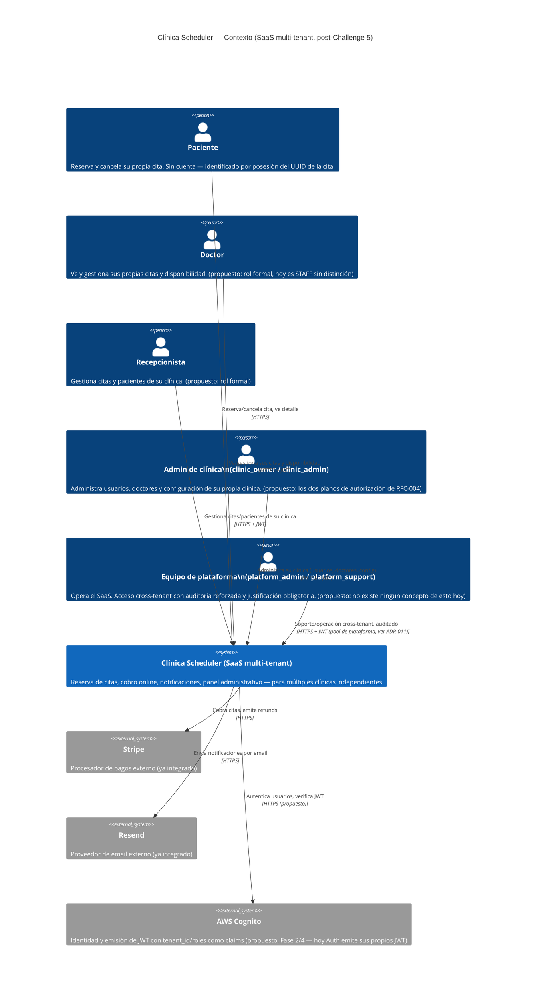

# C4 Nivel 1 — Diagrama de Contexto

**Fase:** 1 del `claude/PLAN-challenge-5-plataforma-para-todos.md`
**Referencia:** `docs/architecture/C4-nivel2-contenedores.md` (Challenge 4, contenedores actuales
sin capa AWS), `docs/rfc/RFC-003-tenancy.md`, `docs/rfc/RFC-004-rbac.md`.

Este es el primer C4 de nivel 1 del proyecto — el Challenge 4 solo produjo nivel 2. Muestra la
plataforma como una caja única, los tipos de usuario (incluyendo los nuevos roles de plataforma
que no existen hoy) y los sistemas externos. Los elementos marcados **"(propuesto)"** no existen
todavía en el sistema real; reflejan lo que este challenge se propone construir.

## Lectura del diagrama

- **Los tres roles de tenant granulares** (`doctor`, `receptionist`, distinción
  `clinic_owner`/`clinic_admin`) son propuestos por RFC-004 — hoy el sistema solo distingue
  `ADMIN`/`STAFF` sin este nivel de detalle. Este diagrama documenta la intención, no el estado
  actual (ver `docs/architecture/C4-nivel2-contenedores.md` para el estado de contenedores real
  del Challenge 4).
- **El equipo de plataforma no existe como concepto hoy.** Es el plano de autorización que RFC-004
  introduce explícitamente para no repetir el error común de SaaS B2B de mezclar "admin de todo"
  con "admin de una clínica".
- **Stripe y Resend ya están integrados** (sin cambios en este challenge) — se muestran para
  completar el contexto, no porque este challenge los toque.
- **Cognito es propuesto.** El sistema de identidad real hoy es `services/auth` con JWT RS256
  propio (ver ADR-011 para la decisión de cuántos user pools usar cuando se migre).
