# C4 Nivel 2 — Diagrama de Contenedores (con capa AWS propuesta)

**Fase:** 1 del `claude/PLAN-challenge-5-plataforma-para-todos.md`
**Referencia:** `docs/architecture/C4-nivel2-contenedores.md` — el C4 nivel 2 del Challenge 4,
que documenta los contenedores **reales** de hoy (Docker Compose, sin AWS). Este documento no lo
reemplaza: lo extiende agregando la capa de infraestructura AWS que el Challenge 5 propone
construir. Todo lo marcado **"(propuesto)"** no existe todavía.

```mermaid
C4Container
    title Clínica Scheduler — Contenedores + infraestructura AWS (propuesta, Fase 2)

    Person(patient, "Paciente")
    Person(staff, "Admin/Staff de clínica")
    Person(platformOps, "Equipo de plataforma (propuesto)")

    System_Boundary(edge, "Perímetro (propuesto, Fase 2)") {
        Container(waf, "WAF", "AWS WAF", "Managed rule groups + rate limiting por IP/tenant (propuesto)")
        Container(alb, "ALB", "Application Load Balancer", "Enruta hacia el gateway (propuesto)")
    }

    System_Boundary(clinica, "Clínica Scheduler") {
        Container(gateway, "Gateway", "Fastify (real, hoy)", "Reverse proxy, valida JWT, enruta por /v1/<servicio>")

        Container(auth, "Auth Service", "Node.js + Postgres propio (real)", "Login, JWT, JWKS — a migrar a Cognito (propuesto, ADR-011)")
        Container(appointments, "Appointments Service", "Node.js + Postgres propio (real)", "State machine de citas + Patients + API admin + Outbox")
        Container(doctors, "Doctors Service", "Node.js + Postgres propio (real)", "Perfil de doctor, disponibilidad, slots")
        Container(payments, "Payments Service", "Node.js + Postgres propio (real)", "Integración Stripe, webhook receiver")
        Container(notifications, "Notifications Service", "Node.js + Postgres propio (real)", "Consumer de eventos, envío de email, read-model")
        Container(tenantProv, "Tenant Provisioning", "Node.js (propuesto, Fase 8)", "Plano de control de onboarding/offboarding de clínicas")

        ContainerDb(redis, "Redis Streams / ElastiCache", "Redis (real hoy en Docker; propuesto: ElastiCache gestionado, ver ADR-014)", "Broker de eventos de dominio + colas BullMQ")
        ContainerDb(rds, "RDS PostgreSQL x5", "Amazon RDS Multi-AZ (propuesto, Fase 2)", "Una instancia por servicio, RLS habilitado (ver ADR-005/006)")
        ContainerDb(auditlog, "Audit Log", "Tabla append-only + S3 Object Lock (propuesto, Fase 5, ver ADR-013)", "Registro inmutable de accesos a PII")
        Container(s3, "S3", "Amazon S3 (propuesto, Fase 2/5)", "Adjuntos, export de audit log, backups")
        Container(secrets, "Secrets Manager", "AWS Secrets Manager (propuesto, Fase 2)", "Credenciales de RDS con rotación, secretos de Stripe/Resend")
        Container(cognitoC, "Cognito", "AWS Cognito (propuesto, ADR-011)", "User pool(s), tenant_id como claim vía pre-token-generation trigger")
    }

    System_Ext(stripe, "Stripe")
    System_Ext(resend, "Resend")

    Rel(patient, waf, "HTTPS")
    Rel(staff, waf, "HTTPS + JWT")
    Rel(platformOps, waf, "HTTPS + JWT (pool de plataforma)")
    Rel(waf, alb, "filtra")
    Rel(alb, gateway, "HTTP")

    Rel(gateway, auth, "Login / verificar JWT", "HTTP")
    Rel(gateway, appointments, "CRUD citas/pacientes/admin", "HTTP")
    Rel(gateway, doctors, "CRUD doctores/slots", "HTTP")
    Rel(gateway, payments, "Refunds (admin)", "HTTP")
    Rel(gateway, notifications, "Dead-letter/health (admin)", "HTTP")
    Rel(gateway, tenantProv, "Onboarding/offboarding (admin plataforma)", "HTTP (propuesto)")

    Rel(auth, cognitoC, "Delega autenticación (propuesto)", "HTTP")

    Rel(appointments, doctors, "¿Qué slots están libres?", "HTTP")
    Rel(appointments, payments, "Crear PaymentIntent / Refund", "HTTP")
    Rel(payments, stripe, "PaymentIntents, refunds, webhooks", "HTTP")
    Rel(notifications, resend, "Enviar email", "HTTP")

    Rel(auth, rds, "User, RefreshToken (+ tenant_id, propuesto)")
    Rel(appointments, rds, "Patient, Appointment (+ tenant_id, RLS, propuesto)")
    Rel(doctors, rds, "Doctor, Availability (+ tenant_id, propuesto)")
    Rel(payments, rds, "WebhookEvent (+ tenant_id, propuesto)")
    Rel(notifications, rds, "Snapshots, NotificationLog (+ tenant_id, propuesto)")

    Rel(appointments, redis, "Outbox relay + consumer (tenant_id obligatorio, propuesto)", "evento")
    Rel(doctors, redis, "Outbox relay (tenant_id obligatorio, propuesto)", "evento")
    Rel(payments, redis, "Outbox relay (tenant_id obligatorio, propuesto)", "evento")
    Rel(notifications, redis, "consumer (tenant_id obligatorio, propuesto)", "evento")

    Rel(appointments, auditlog, "Escribe en cada acceso a PII (propuesto, Fase 5)")
    Rel(auth, auditlog, "Escribe en cada acceso a PII (propuesto, Fase 5)")
    Rel(auditlog, s3, "Export con Object Lock (propuesto)")

    Rel(auth, secrets, "Credenciales de RDS (propuesto)")
    Rel(payments, secrets, "Stripe secret (propuesto)")
    Rel(notifications, secrets, "Resend API key (propuesto)")
```

## Lectura del diagrama

- **Todo lo etiquetado "(real, hoy)" es exactamente lo que ya corre en Docker Compose** —
  documentado en `docs/baseline-challenge-4.md` y en `docs/architecture/C4-nivel2-contenedores.md`.
  Este diagrama no inventa contenedores nuevos ahí; solo les agrega alrededor la infraestructura
  AWS que la Fase 2 construye.
- **`tenant_id (propuesto)` aparece en cada relación con RDS y con Redis** porque ninguna tabla ni
  evento lo tiene hoy (Supuesto S5 y S3-parcial del baseline) — es la representación visual de que
  la Fase 3 no es opcional para llegar a este estado.
- **`Tenant Provisioning` es un contenedor completamente nuevo** (Fase 8) — no existe ningún
  análogo hoy, ni siquiera como esqueleto.
- **`Audit Log` es un contenedor conceptual nuevo** (Fase 5) — distinto de `AppointmentEvent`/
  `OutboxEvent` que ya existen (esos registran cambios de estado de negocio, no accesos a PII; ver
  ADR-013).
- **RDS Multi-AZ, WAF, ALB, Secrets Manager, S3 y Cognito son 100% propuestos** — el sistema real
  hoy no tiene ninguno (Supuesto S7 del baseline, confirmado).
