# C4 Nivel 2 — Diagrama de Contenedores (con capa AWS)

**Fase:** 1 y 2 del `claude/PLAN-challenge-5-plataforma-para-todos.md`
**Referencia:** `docs/architecture/C4-nivel2-contenedores.md` — el C4 nivel 2 del Challenge 4,
que documenta los contenedores **reales** de hoy (Docker Compose, sin AWS). Este documento no lo
reemplaza: lo extiende agregando la capa de infraestructura AWS.

Tres estados posibles, marcados explícitamente en cada elemento:
- **"(real, hoy)"** — corre en Docker Compose, sin cambios de este challenge.
- **"(IaC lista, Fase 2)"** — el código CDK existe en `infra/` y fue validado con `cdk synth`,
  pero **no se ha desplegado a AWS**.
- **"(propuesto)"** — todavía no existe ni como código ni como infraestructura.

```mermaid
C4Container
    title Clínica Scheduler — Contenedores + infraestructura AWS

    Person(patient, "Paciente")
    Person(staff, "Admin/Staff de clínica")
    Person(platformOps, "Equipo de plataforma (propuesto, RFC-004)")

    System_Boundary(edge, "Perímetro") {
        Container(waf, "WAF", "AWS WAF (IaC lista, Fase 2)", "Managed rule groups (Core/SQLi/Known Bad Inputs) + rate limiting por IP — por tenant queda pendiente, ver infra/README.md")
        Container(alb, "ALB", "Application Load Balancer (IaC lista, Fase 2)", "HTTP:80 hacia el gateway — sin dominio/ACM cert todavía")
    }

    System_Boundary(computeB, "Compute (IaC lista, Fase 2)") {
        Container(cluster, "ECS Fargate + Cloud Map", "ADR-007", "Cluster + service discovery interno (*.clinica.local) para los 6 contenedores")
    }

    System_Boundary(clinica, "Clínica Scheduler") {
        Container(gateway, "Gateway", "Fastify (real, hoy)", "Reverse proxy, valida JWT, enruta por /v1/<servicio>")

        Container(auth, "Auth Service", "Node.js + Postgres propio (real)", "Login, JWT, JWKS — a migrar a Cognito (ADR-011)")
        Container(appointments, "Appointments Service", "Node.js + Postgres propio (real)", "State machine de citas + Patients + API admin + Outbox")
        Container(doctors, "Doctors Service", "Node.js + Postgres propio (real)", "Perfil de doctor, disponibilidad, slots")
        Container(payments, "Payments Service", "Node.js + Postgres propio (real)", "Integración Stripe, webhook receiver")
        Container(notifications, "Notifications Service", "Node.js + Postgres propio (real)", "Consumer de eventos, envío de email, read-model")
        Container(tenantProv, "Tenant Provisioning", "Node.js (propuesto, Fase 8)", "Plano de control de onboarding/offboarding de clínicas")

        ContainerDb(messaging, "SQS + SNS", "IaC lista, Fase 2, ADR-014", "Reemplaza Redis Streams + BullMQ por completo — topic domain-events + colas de expiration/reminders/no-show, cada una con DLQ")
        ContainerDb(rds, "RDS PostgreSQL x5", "Amazon RDS Single-AZ (IaC lista, Fase 2, ADR-015)", "Una instancia por servicio, RLS pendiente de habilitar (Fase 3, ADR-005/006)")
        ContainerDb(auditlog, "Audit Log", "Tabla append-only (propuesto, Fase 5, ADR-013)", "Registro inmutable de accesos a PII — el bucket S3 destino ya existe (IaC), la tabla y la lógica de escritura no")
        Container(s3, "S3", "Amazon S3 (IaC lista, Fase 2)", "Buckets: audit-log-export (Object Lock compliance solo staging/prod), attachments (sin uso hoy), backups")
        Container(secrets, "Secrets Manager", "AWS Secrets Manager (IaC lista, Fase 2)", "Credenciales de RDS con rotación automática (30 días)")
        Container(cognitoC, "Cognito", "AWS Cognito (IaC lista, Fase 2, ADR-011)", "Un único user pool compartido, tenant_id/role como atributos custom. Trigger de pre-token-generation es un stub — la lógica real es Fase 3/4")
    }

    System_Ext(stripe, "Stripe")
    System_Ext(resend, "Resend")

    Rel(patient, waf, "HTTP (sin TLS todavia)")
    Rel(staff, waf, "HTTP + JWT")
    Rel(platformOps, waf, "HTTP + JWT (pool de plataforma)")
    Rel(waf, alb, "filtra")
    Rel(alb, gateway, "HTTP, via target group del gateway")

    Rel(cluster, gateway, "hospeda")
    Rel(cluster, auth, "hospeda")
    Rel(cluster, appointments, "hospeda")
    Rel(cluster, doctors, "hospeda")
    Rel(cluster, payments, "hospeda")
    Rel(cluster, notifications, "hospeda")

    Rel(gateway, auth, "Login / verificar JWT", "HTTP via Cloud Map")
    Rel(gateway, appointments, "CRUD citas/pacientes/admin", "HTTP via Cloud Map")
    Rel(gateway, doctors, "CRUD doctores/slots", "HTTP via Cloud Map")
    Rel(gateway, payments, "Refunds (admin)", "HTTP via Cloud Map")
    Rel(gateway, notifications, "Dead-letter/health (admin)", "HTTP via Cloud Map")
    Rel(gateway, tenantProv, "Onboarding/offboarding (admin plataforma)", "HTTP (propuesto)")

    Rel(auth, cognitoC, "Delega autenticación (propuesto, migración de código en Fase 3/4)", "HTTP")

    Rel(appointments, doctors, "¿Qué slots están libres?", "HTTP via Cloud Map")
    Rel(appointments, payments, "Crear PaymentIntent / Refund", "HTTP via Cloud Map")
    Rel(payments, stripe, "PaymentIntents, refunds, webhooks", "HTTP")
    Rel(notifications, resend, "Enviar email", "HTTP")

    Rel(auth, rds, "User, RefreshToken (+ tenant_id, propuesto Fase 3)")
    Rel(appointments, rds, "Patient, Appointment (+ tenant_id, RLS, propuesto Fase 3)")
    Rel(doctors, rds, "Doctor, Availability (+ tenant_id, propuesto Fase 3)")
    Rel(payments, rds, "WebhookEvent (+ tenant_id, propuesto Fase 3)")
    Rel(notifications, rds, "Snapshots, NotificationLog (+ tenant_id, propuesto Fase 3)")

    Rel(appointments, messaging, "Outbox relay + consumer (reescritura de codigo pendiente, Fase 3)", "evento")
    Rel(doctors, messaging, "Outbox relay (reescritura de codigo pendiente, Fase 3)", "evento")
    Rel(payments, messaging, "Outbox relay (reescritura de codigo pendiente, Fase 3)", "evento")
    Rel(notifications, messaging, "consumer (reescritura de codigo pendiente, Fase 3)", "evento")

    Rel(appointments, auditlog, "Escribe en cada acceso a PII (propuesto, Fase 5)")
    Rel(auth, auditlog, "Escribe en cada acceso a PII (propuesto, Fase 5)")
    Rel(auditlog, s3, "Export con Object Lock (bucket ya existe, IaC lista)")

    Rel(auth, secrets, "Credenciales de RDS (IaC lista)")
    Rel(payments, secrets, "Stripe secret (pendiente de migrar desde .env, Fase 2 solo aprovisiona el recurso)")
    Rel(notifications, secrets, "Resend API key (pendiente de migrar desde .env, Fase 2 solo aprovisiona el recurso)")
```

## Lectura del diagrama

- **Todo lo etiquetado "(real, hoy)" es exactamente lo que ya corre en Docker Compose** —
  documentado en `docs/baseline-challenge-4.md` y en `docs/architecture/C4-nivel2-contenedores.md`.
  Ningún código de aplicación cambió en la Fase 2 (guardrail explícito).
- **"(IaC lista, Fase 2)" significa código CDK real, validado con `cdk synth`, sin desplegar** —
  ver `infra/README.md` para el detalle de qué se validó y qué queda pendiente de verificar contra
  una cuenta AWS real (nombres de AZ, disponibilidad de `AWS::Budgets::Budget` en `mx-central-1`).
- **RDS es Single-AZ, no Multi-AZ** — corrección respecto a la versión anterior de este diagrama:
  ADR-015 (aceptado en la revisión de Fase 1) decidió backup & restore con Single-AZ por defecto,
  no el Multi-AZ que el texto original del plan maestro asumía.
- **Redis Streams ya no aparece**: ADR-014 decidió migrar toda la mensajería a SQS+SNS,
  descartando Redis Streams/BullMQ por completo. El contenedor `messaging` en este diagrama ya
  refleja esa decisión — la reescritura del código de aplicación que hoy usa
  `event-consumer.ts`/`outbox-relay.ts`/BullMQ queda pendiente para la Fase 3.
- **`tenant_id (propuesto)` sigue apareciendo en cada relación con RDS** porque ninguna tabla lo
  tiene hoy (Supuesto S5 del baseline) — la Fase 3 sigue siendo el trabajo pendiente, la Fase 2 solo
  aprovisionó la infraestructura donde esas tablas van a vivir.
- **`Tenant Provisioning` y `Audit Log` (como tabla/lógica) siguen siendo "(propuesto)"** — Fases 8
  y 5 respectivamente. El bucket S3 destino del audit log sí existe como IaC desde la Fase 2, pero
  eso es solo el almacenamiento, no la lógica que escribe en él.
- **Cognito existe como IaC pero su trigger de pre-token-generation es un stub** — inyectar
  `tenant_id`/rol reales al JWT requiere que exista el modelo de datos de tenancy (Fase 3) y el
  motor de permisos (`packages/authz/`, Fase 4).

## Changelog

- **2026-07-29 (Fase 1):** versión inicial de este documento, con toda la capa AWS marcada
  "(propuesto)".
- **2026-07-29 (Fase 2):** actualizado tras generar y validar el CDK de `infra/` (9 stacks). WAF,
  ALB, RDS, S3, Secrets Manager y Cognito pasan de "(propuesto)" a "(IaC lista, Fase 2)". Redis
  Streams se reemplaza por SQS+SNS en el diagrama (ADR-014). RDS corregido de Multi-AZ a Single-AZ
  (ADR-015). Se agrega el contenedor de compute (ECS Fargate + Cloud Map). `tenant_id`,
  `Audit Log` (tabla) y `Tenant Provisioning` siguen "(propuesto)" — son trabajo de las Fases 3, 5
  y 8 respectivamente, no de la Fase 2.
